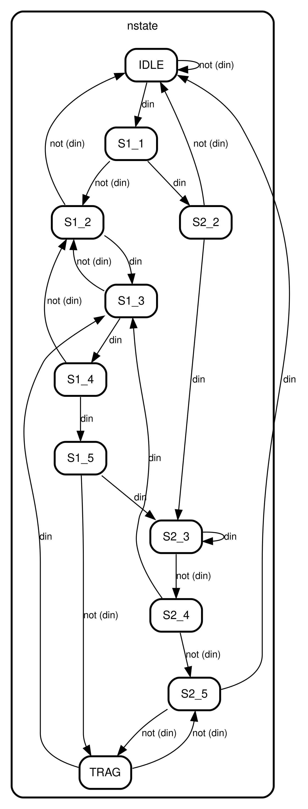

# 可重复检测的双序列检测器
## 1.设计功能与要求


## 2.算法原理
本设计采用 **三段式状态机** 实现。

### 2.1 三段式状态机
有限状态机状态机(Finite State Machine, FSM)是对电路顺序工作建模的强有力工具，根据状态机的编写风格可以分为一段式、两段式、三段式状态机。其中三段式状态机由于其性能优越、结构简单、易于维护等优点被普遍使用。三段式状态机普遍被分为状态寄存器(State Register)、下一周期状态生成逻辑(Next State Logic)、输出逻辑(Output Logic)三段，根据输出和输入的关系三段式状态机又分为Moore型状态机和Mealy型状态机。

Moore型状态机的框图如下，可以看到Output Logic仅与CS(Current State)相关。


Mealy型状态机的框图如下，可以看到Output Logic不仅与CS(Current State)相关，还与当前的输入x相关。


从框图可以看出，Moore型状态机输出仅与状态相关，避免了输入信号x毛刺造成的亚稳态问题，但是通常需要更多状态可能增加状态转移寄存器位宽。Mealy型状态机的状态数量更少，但存在输入信号x毛刺引起的亚稳态问题。在本文的设计中使用三段式Moore型状态机。

### 2.2 可重复检测的序列检测器
所谓的可重复序列检测器，是指当检测到完整目标序列后并不会跳回到初始状态，而是跳到部分重叠序列的状态继续进行检测，
以目标序列为“10010”为例，其状态转移图如下所示，左边为可重复检测的序列检测器的状态转移图，右边是非重复检测的序列检测器的状态转移图。
假设输入序列为“0100100101”，对于非重复检测而言，其输出应该是“0000001000”（假设在检测到目标序列后下一个时钟周期变为高电平），
而可重复序列检测的输出应该是“0000001001”，因为在检测完第一个“10010”之后又出现了一个“10010”序列。


以上图像左边和右边分别代表可重复序列检测和非重复序列检测的状态转移图，其区别在于检测状态S5到其他状态跳变分支不同，
使用紫色和红色表示对比。

总之，对于非重复序列检测，在S5状态时无论下一个输入为0还是1则一律跳回状态S0，而可重复序列检测则需要根据部分序列特征跳到对应的状态。

### 2.3 双序列检测

双序列检测是指目标序列有两个，而非2.2小节中所介绍的一个，例如在本题中需要实现对序列“111000”或“101110”的检测。
双序列检测和单序列检测的区别在于需要根据重叠序列进行状态精简，其状态转移图往往更加复杂。

根据本题的设定结合2.1-2.3小节知识可以得到如下状态转移图，其中IDLE代表初始状态、TRAG代表触发状态、S1_1到S1_5代表目标序列“111000”检测状态、S2_2到S2_5代表目标序列“101110”的检测状态，
由于两个序列第一个数值均为1，因此并没有S2_1状态以精简状态数量。状态机在TRAG状态下输出result为高电平，其他状态下均为低电平。




综上所述，我们明确了可重复双序列检测器的状态转移图，剩下的工作就是使用三段式状态机结构进行RTL实现。

## 3.RTL实现
采用三段式状态机实现，首先进行状态参数定义，然后编写FSM第一段状态转移时序逻辑、FSM第二段产生下一个状态的组合逻辑、FSM第三段产生输出的时序逻辑。需要注意的时FSM第三段也可以采用组合逻辑实现，采用组合逻辑实现时判断状态应该使用cstate，采用时序逻辑实现时判断状态使用nstate，后者的好处是切分组合逻辑延时，提高时钟频率。
```verilog
module seq_detector(
    input clk,
    input rst_n,
    input din_vld,
    input din,
    output reg result
    );
    // parameters
    localparam IDLE = 11'b00000000001;
    localparam S1_1 = 11'b00000000010;
    localparam S1_2 = 11'b00000000100;
    localparam S1_3 = 11'b00000001000;
    localparam S1_4 = 11'b00000010000;
    localparam S1_5 = 11'b00000100000;
    localparam S2_2 = 11'b00001000000;
    localparam S2_3 = 11'b00010000000;
    localparam S2_4 = 11'b00100000000;
    localparam S2_5 = 11'b01000000000;
    localparam TRAG = 11'b10000000000;

    // signal defination
    reg [10:0]nstate, cstate;

    // FSM1
    always @(posedge clk or negedge rst_n) begin
        if(!rst_n)begin
            cstate <= IDLE;
        end
        else if(din_vld)begin
            cstate <= nstate;
        end
        else begin
            cstate <= cstate;
        end
    end

    // FSM2
    always @(*) begin
        case(cstate)
            IDLE:begin
                if(din) begin
                    nstate = S1_1;
                end
                else begin
                    nstate = IDLE;
                end
            end
            S1_1:begin
                if(din) begin
                    nstate = S2_2;
                end
                else begin
                    nstate = S1_2;
                end
            end
            S1_2:begin
                if(din) begin
                    nstate = S1_3;
                end
                else begin
                    nstate = IDLE;
                end
            end
            S1_3:begin
                if(din) begin
                    nstate = S1_4;
                end
                else begin
                    nstate = S1_2;
                end
            end
            S1_4:begin
                if(din) begin
                    nstate = S1_5;
                end
                else begin
                    nstate = S1_2;
                end
            end
            S1_5:begin
                if(din) begin
                    nstate = S2_3;
                end
                else begin
                    nstate = TRAG;
                end
            end
            S2_2:begin
                if(din) begin
                    nstate = S2_3;
                end
                else begin
                    nstate = IDLE;
                end
            end
            S2_3:begin
                if(din)begin
                    nstate = S2_3;
                end
                else begin
                    nstate = S2_4;
                end
            end
            S2_4:begin
                if(din) begin
                    nstate = S1_3;
                end
                else begin
                    nstate = S2_5;
                end
            end
            S2_5:begin
                if(din) begin
                    nstate = IDLE;
                end
                else begin
                    nstate = TRAG;
                end
            end
            TRAG:begin
                if(din) begin
                    nstate = S1_3;
                end
                else begin
                    nstate = S2_5;
                end
            end
            default: nstate = IDLE;
        endcase
    end

    // FSM3
    always @(posedge clk or negedge rst_n) begin
        if(!rst_n)begin
            result <= 1'b0;
        end
        else if(nstate == TRAG)begin
            result <= 1'b1;
        end
        else begin
            result <= 1'b0;
        end
    end

endmodule
```

Vivado RTL analysis结果如下图所示，可以看到具有明显的三段式状态机结构，符合设计预期。


## 4.RTL仿真结果
使用题目中给出的数值作为测试用例
### 测试用例：采用题目中所给出的示例作为测试用例
    [I]	0 0 1 1 1 0 0 0 1 1 0 1 1 1 0 0 0 0
	[O]	0 0 0 0 0 0 0 0 1 0 0 0 0 0 0 1 0 1
仿真波形如下图所示，与预期输出相同，功能正确。


# 写在最后
2025年1月上旬总算结束了研一上学期繁忙的课程，总算有时间整理总结UCAS《高等数字集成电路分析与设计》课程中老师所布置的作业题，作为老师上课来不及仔细讲解内容的补充，也作为以后自己复习的参考。笔者作为初学者难免出现错误，请读者多多批评指正，也希望看到本博客的学弟学妹多多思考、不要盲目抄袭。

# 源码
verilog源码开源在：[lionelZhaowy/Digital-IC-Analysis-and-Design](https://github.com/lionelZhaowy/Digital-IC-Analysis-and-Design.git "lionelZhaowy/Digital-IC-Analysis-and-Design")

**作者：LionelZhao 欢迎转载，主动输出、与人分享是进步的源泉！！！**

**转载请保留原文地址：[lionelZhaowy/Digital-IC-Analysis-and-Design](https://github.com/lionelZhaowy/Digital-IC-Analysis-and-Design.git "lionelZhaowy/Digital-IC-Analysis-and-Design")**

**创作不易，如果觉得本文对您有帮助欢迎读者客官多多打赏！！！**


工程文件请在海鲜市场购买。
