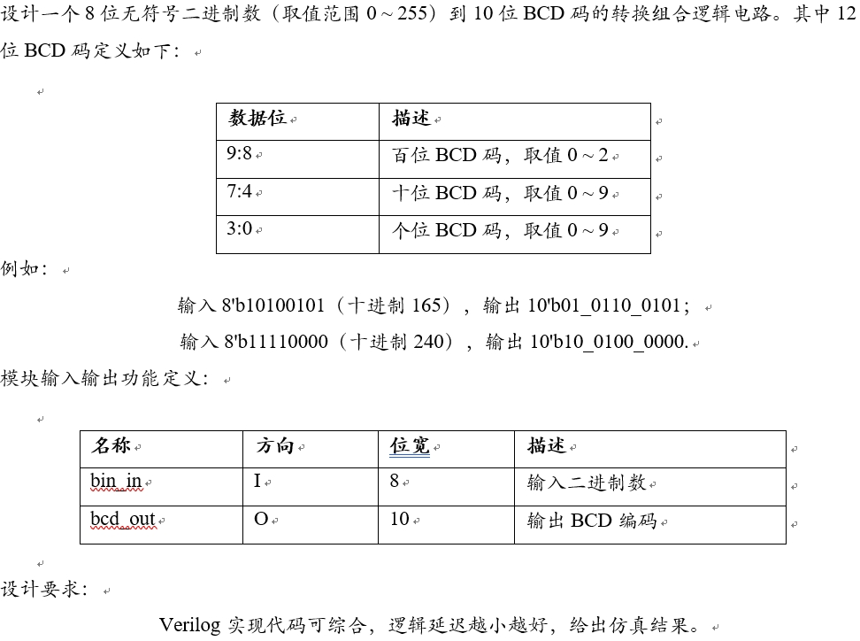

# 二进制转BCD码逻辑
## 1.设计功能与要求


## 2.算法原理
本设计采用 **加3移位法(double dabble)** 实现。由于4bit二进制数是逢16进位，而BCD码是逢10进位，因而将数值大于9的4bit二进制数加6就能得到对应的BCD码。4bit二进制数转为5bit BCD码对照表5如下图所示，从对应关系中可以得出二进制数逢9加6便可得到对应BCD码。


上述转换关系只适用于4bit二进制数，对于大于4bit的二进制数，通过迭代左移每4位逢9加6进位即可实现任意位的二进制数到BCD码的转换。以30为例其转换过程如下，30的二进制数5'b1_1110可以通过15的二进制数5'b0_1111左移1位(即×2)获得。可以通过15的5bit BCD码5'b1_0101来获得其倍数30的BCD码，具体过程为首先左移1bit得到6'b10_1010，发现其低4bit数4'b1010>4'b1001，因此根据逢9加6规则需要进位，进位之后的数值6'b11_0000即为30的BCD码。


为了方便其间，以30为例进进行一次左移加6的迭代。举一反三，再以255的8bit二进制8'b1111_1111为例进行多次迭代计算得到10bit的BCD码10'b01_0101_0101，其迭代转换过程如下图所示，每次迭代首先左移1bit，然后检查百位、十位、个位的二进制数是否大于9，若大于则逢9加6，反之则保持不变，重复上述过程迭代直到所有二进制数位被移出。


在上述255的BCD码转换过程中，可以将左移加6等效计算为加3左移，这样做的好处是可以缩减加法器位宽从而节省硬件资源。等效计算如下图所示，逢9加6替换为逢5加3。


综上所述，我们明确了double dabble算法的原理，即通过加3位移的方式循环迭代实现8bit二进制数到10bit BCD码的转换，下一节将探讨RTL实现。

## 3.RTL实现
### 3.1 循环展开
在RTL实现时可以通过对double dabble算法的循环展开充分利用硬件并行性来提高计算速度，通过多个加法器实现一个时钟周期计算出转换的结果，而非单个加法器处理多个时钟周期进行转换。

循环展开后的框图如下所示，通过观察上一节255转换过程演示图中不难发现，前三次操作一定是左移（只有3bit数才会可能大于5），因此Adder1输出为{1'b0, a[7:5]}，此后Adder2和Adder3进行左移1bit、判断逢5加3操作，此后的数值已经超过4bit，因此需要使用Adder4和Adder5分开处理高4位和低4位，此后使用Adder6和Adder7进行左移1bit、判断逢5加3操作，最终得到转换之后的10bit的BCD码。


这里再以255转换过程为例展示上述框图的转换过程，其中红色位大于5加3的结果，橙色为没有逢5加3的数值。


### 3.2 Adder实现
由于加法器的逻辑资源开销较大，这里采用case语句实现多路选择器的方式实现加法操作的替代，Verilog代码如下：
```verilog
module add3_g4(
    input       clk,
    input       rst_n, 
	input		[3:0]	in,
	output reg	[3:0]	out
);
    //利用查找表实现+3操作
    always @ (posedge clk or negedge rst_n) begin
        if(!rst_n)begin
            out <= 4'd0;
        end
        else begin
            case (in) 
                4'b0101 : out <= 4'b1000;
                4'b0110 : out <= 4'b1001;
                4'b0111 : out <= 4'b1010;
                4'b1000 : out <= 4'b1011;
                4'b1001 : out <= 4'b1100;
                default : out <= in;
            endcase
        end
    end

endmodule 
```

### 3.3 顶层模块
根据3.1和3.2小节的描述可以编写一下顶层模块：
```verilog
module bin_in2BCDcode(
    input clk,
    input rst_n,
    input [7:0]bin_in,
    output reg [9:0]bcd_out
);
    // signals
    wire [3:0] t1, t2, t3, t4, t5, t6, t7;

    // instances
    add3_g4 adder1(
        .clk(clk),
        .rst_n(rst_n),
        .in	({1'b0, bin_in[7:5]}),
        .out(t1)
    );
    add3_g4 adder2(
        .clk(clk),
        .rst_n(rst_n),
        .in	({t1[2:0], bin_in[4]}),
        .out(t2)
    );
    add3_g4 adder3(
        .clk(clk),
        .rst_n(rst_n),
        .in({t2[2:0], bin_in[3]}),
        .out(t3)
    );
    add3_g4 adder4(
        .clk(clk),
        .rst_n(rst_n),
        .in({1'b0, t1[3], t2[3], t3[3]}),
        .out(t4)
    );
    add3_g4 adder5(
        .clk(clk),
        .rst_n(rst_n),
        .in({t3[2:0], bin_in[2]}),
        .out(t5)
    );
    add3_g4 adder6(
        .clk(clk),
        .rst_n(rst_n),
        .in({t4[2:0], t5[3]}),
        .out(t6)
    );
    add3_g4 adder7(
        .clk(clk),
        .rst_n(rst_n),
        .in({t5[2:0], bin_in[1]}),
        .out(t7)
    );

    // output
    always @(posedge clk or negedge rst_n) begin
        if(!rst_n)begin
            bcd_out <= 10'd0;
        end
        else begin
            bcd_out <= {2'b0, t4[3], t6[3:0], t7[3:0], bin_in[0]};
        end
    end

endmodule
```
Vivado RTL analysis结果如下图所示，可以看到adder的连接关系符合设计预期。


adder的RTL analysis结果如下图所示，采用多路选择器实现符合设计预期。


## 4.RTL仿真结果
使用题目中给出的数值作为测试用例
### 测试用例1：输入8'b10100101（十进制165），输出10'b01_0110_0101


### 测试用例2：输入8'b11110000（十进制240），输出10'b10_0100_0000


# 参考与致谢
#### 1. [Verilog实现2进制码与BCD码的互相转换](https://blog.csdn.net/wuzhikaidetb/article/details/136039824 "Verilog实现2进制码与BCD码的互相转换")。
#### 2. [加三移位法-二进制数转换为BCD码](https://blog.csdn.net/Russius/article/details/78992138 "加三移位法-二进制数转换为BCD码")。

# 写在最后
2025年1月上旬总算结束了研一上学期繁忙的课程，总算有时间整理总结UCAS《高等数字集成电路分析与设计》课程中老师所布置的作业题，作为老师上课来不及仔细讲解内容的补充，也作为以后自己复习的参考。笔者作为初学者难免出现错误，请读者多多批评指正，也希望看到本博客的学弟学妹多多思考、不要盲目抄袭。
