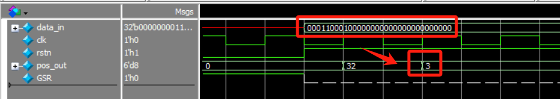

# 向量前导1检测器
## 1.设计功能与要求


## 2.算法原理
本设计采用 **二分法** 实现。对于一个32位二进制数而言，首先将其分为高16位和低16位，使用与运算检测高16位是否存在1，如果是则将高16位继续拆分为高8位和低8位继续进行与运算判断，如果否则将低16位继续拆分为高8位和低8位继续进行与运算判断。8位、4位、2位的判断以此类推，二分法检测向量前导1的算法流程图如下，其中Data_in为32位输入数据，Part_1为第一次二分查找的16位数据、Part_2为第二次二分查找的8位数据、Part_3为第三次二分查找的4位数据、Part_4为第四次二分查找的2位数据。


通过上述流程图所描述的过程我们找到了向量中第一个1，但是如何产生其对应的位置索引？这里我们设置5bit的标志编码data_chk，其高位到低位依次为Data_in高16位按位与、Part_1高8位按位与、Part_2高4位按位与、Part_3高2位按位与、Part_4高1位按位与的结果。下面以向量32'b00011000_10000000_00000000_00000000为例说明如何通过data_chk获得前导1的位置，如下图所示，从Data_in逐步二分得到的data_chk的反码恰好为二进制3，对应到前导1在从高位到低位的第4个位置(索引从0开始)。


因此，前导1的位置索引Pos_index=~data_chk。对于输入向量全为0的情况，需要输出Pos_index为32表示该向量中不存在1，但是此时data_chk=5'b00000取反得到5'b11111=5'd31是错误的，需要使用额外判断进行纠正。

综上所述，我们明确了二分法检测向量前导1的原理，二分逐步缩小前导1所在的范围然后通过将标志取反得到前导1的位置索引，下一节将探讨RTL实现。

## 3.RTL实现
由于设计要求尽可能提高频率，而纯组合逻辑无法进行静态时序分析，因此对于输入data_in使用data_in_r进行寄存，输出pos_out为组合逻辑输出，Verilog代码如下：
```verilog
module fst1_sel(
	input clk,
	input rstn,
    input 	[31:0]	data_in,
    output 	reg [5:0]	Pos_out
);
    // signal defination
    reg	 [31:0]	data_in_r;
    wire [4:0]  data_chk;
    wire [15:0] Part_1;	
    wire [7:0]  Part_2;
    wire [3:0]  Part_3;
    wire [1:0]  Part_4;

	// 寄存输入
	always @(posedge clk) begin
		data_in_r <= data_in;
	end
    
    // 二分法逐步确定前导1位置
	assign Part_1 = (data_chk[4]) ? data_in_r[31:16] : data_in_r[15:0];
	assign Part_2 = (data_chk[3]) ? Part_1[15:8] : Part_1[7:0];
	assign Part_3 = (data_chk[2]) ? Part_2[7:4] : Part_2[3:0];
	assign Part_4 = (data_chk[1]) ? Part_3[3:2] : Part_3[1:0];

	assign data_chk = {|data_in_r[31:16],|Part_1[15:8],|Part_2[7:4],|Part_3[3:2],|Part_4[1]};

    // 产生输出二进制编码
	always @(posedge clk or negedge rstn) begin
		if (!rstn)begin
			Pos_out <= 6'd0;
		end
		else begin
			if(|data_in_r)begin
				Pos_out <= {1'b0, ~data_chk};
			end
			else begin
				Pos_out <= 6'd32;
			end
		end
	end

endmodule
```

Vivado RTL analysis结果如下图所示，可以看到设计采用多路选择器和与门的组合实现，符合设计预期。


## 4.RTL仿真结果
使用题目中给出的数值作为测试用例
### 测试用例1：输入00011000 10000000 00000000 00000000，输出3


### 测试用例2：输入00000000 11111111 00000000 00000000，输出8


### 测试用例3：输入00000000 00000000 00000000 00001010，输出28


# 参考与致谢
#### [向量前导1检测器的3种verilog实现方案](https://blog.csdn.net/eroDuanDian123456/article/details/122517268 "向量前导1检测器的3种verilog实现方案")。

# 写在最后
2025年1月上旬总算结束了研一上学期繁忙的课程，总算有时间整理总结UCAS《高等数字集成电路分析与设计》课程中老师所布置的作业题，作为老师上课来不及仔细讲解内容的补充，也作为以后自己复习的参考。笔者作为初学者难免出现错误，请读者多多批评指正，也希望看到本博客的学弟学妹多多思考、不要盲目抄袭。

**创作不易，如果觉得本文对您有帮助欢迎读者客官多多打赏！！！**


工程文件请在海鲜市场购买。
