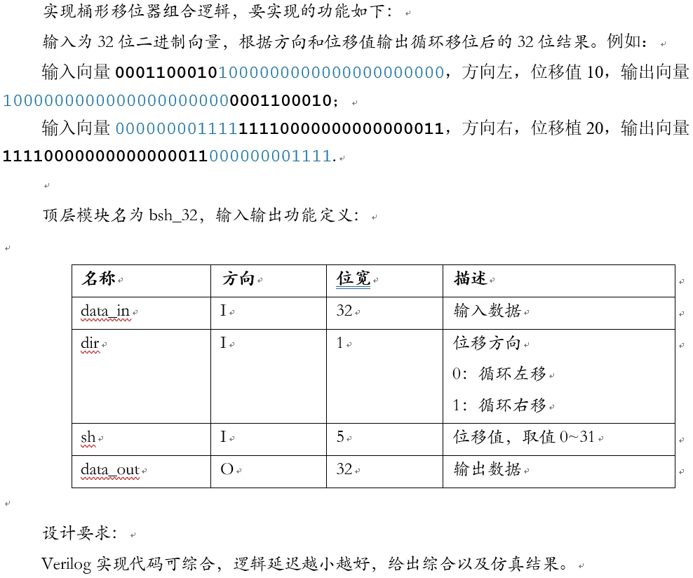
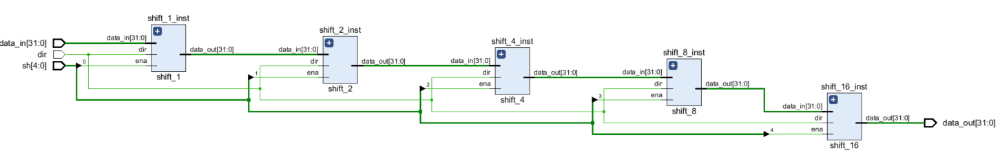
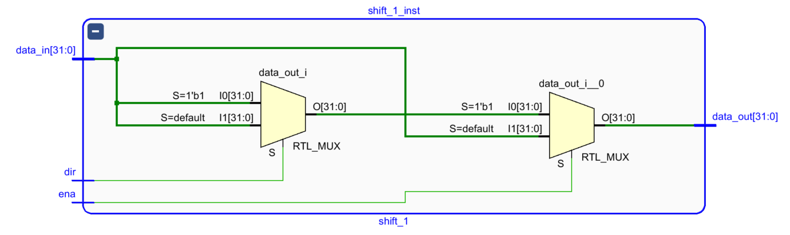
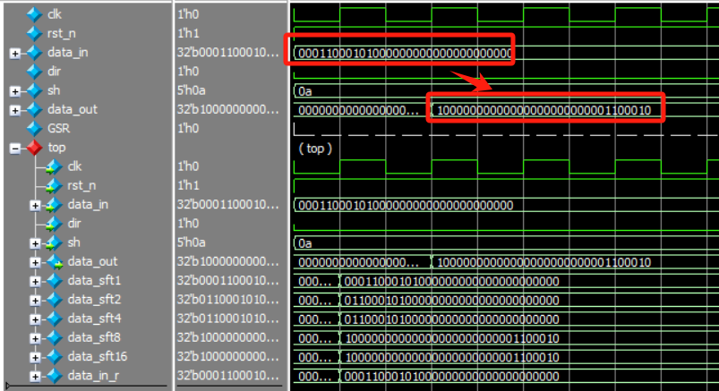
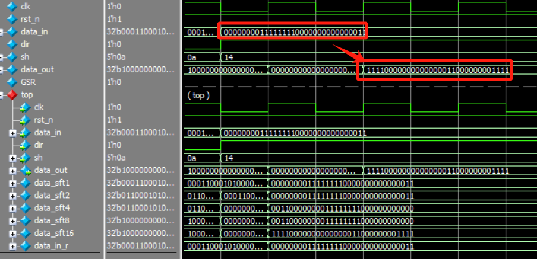

# 32位桶形移位器
## 1.设计功能与要求


## 2.算法原理
桶形移位器的原理较为简单明了，即通过串联多级移位器实现任意方向和位移值。对于32位桶形移位器而言，可通过依次串联位移1位($2^0$)、2位($2^1$)、4位($2^2$)、8位($2^3$)、16位($2^4$)的移位器实现0-31中任意位移值的移位器：

- 第一级可左右循环移动1bit
- 第二级可左右循环移动2bit
- 第三级可左右循环移动4bit
- 第四级可左右循环移动8bit
- 第五级可左右循环移动16bit


循环位移方向的控制通过在if-else语句中使用不同位置的比特位拼接即可得到。本题目中要求dir==1时循环右移、dir==0时循环左移，在移位2位的情况下的实例代码为：
```verilog
    if(dir)begin
        data_out = {data_in[1:0], data_in[31:2]};
    end
    else begin
        data_out = {data_in[29:0], data_in[31:30]};
    end
```

## 3.RTL实现
### 3.1 循环1bit移位器
```verilog
module shift_1(
    input [31:0]data_in,
    input ena,
    input dir,
    output reg [31:0]data_out
    );
    always @(*) begin
        if(ena)begin
            if(dir)begin
                data_out = {data_in[0], data_in[31:1]};
            end
            else begin
                data_out = {data_in[30:0], data_in[31]};
            end
        end
        else begin
            data_out = data_in;
        end
    end
endmodule
```

### 3.2 循环2bit移位器
```verilog
module shift_2(
    input [31:0]data_in,
    input ena,
    input dir,
    output reg [31:0]data_out
    );
    always @(*) begin
        if(ena)begin
            if(dir)begin
                data_out = {data_in[1:0], data_in[31:2]};
            end
            else begin
                data_out = {data_in[29:0], data_in[31:30]};
            end
        end
        else begin
            data_out = data_in;
        end
    end
endmodule
```

### 3.3 循环4bit移位器
```verilog
module shift_4(
    input [31:0]data_in,
    input ena,
    input dir,
    output reg [31:0]data_out
    );
    always @(*) begin
        if(ena)begin
            if(dir)begin
                data_out = {data_in[3:0], data_in[31:4]};
            end
            else begin
                data_out = {data_in[27:0], data_in[31:28]};
            end
        end
        else begin
            data_out = data_in;
        end
        
    end
endmodule
```

### 3.4 循环8bit移位器
```verilog
module shift_8(
    input [31:0]data_in,
    input ena,
    input dir,
    output reg [31:0]data_out
    );
    always @(*) begin
        if(ena)begin
            if(dir)begin
                data_out = {data_in[7:0], data_in[31:8]};
            end
            else begin
                data_out = {data_in[23:0], data_in[31:24]};
            end
        end
        else begin
            data_out = data_in;
        end
    end
endmodule
```

### 3.5 循环16bit移位器
16位无论左移还是右移的数据拼接都为{data_in[15:0], data_in[31:16]}。
```verilog
module shift_16(
    input [31:0]data_in,
    input dir,
    input ena,
    output reg [31:0]data_out
    );
    always @(*) begin
        if(ena)begin
            data_out = {data_in[15:0], data_in[31:16]};
        end
        else begin
            data_out = data_in;
        end
    end
endmodule
```

### 3.6 顶层32位桶形移位器
在顶层中串行连接3.1-3.5小节中设计的移位器即可。
```verilog
module bsh_32(
    input [31:0]data_in,
    input dir,
    input [4:0]sh,
    output [31:0]data_out
    );
    // 声明内部信号
    wire [31:0] data_sft1;
    wire [31:0] data_sft2;
    wire [31:0] data_sft4;
    wire [31:0] data_sft8;
    wire [31:0] data_sft16;

    // 移位器实例化
    shift_1  shift_1_inst (
        .data_in(data_in),
        .ena(sh[0]),
        .dir(dir),
        .data_out(data_sft1)
    );

    shift_2  shift_2_inst (
        .data_in(data_sft1),
        .ena(sh[1]),
        .dir(dir),
        .data_out(data_sft2)
    );

    shift_4  shift_4_inst (
        .data_in(data_sft2),
        .ena(sh[2]),
        .dir(dir),
        .data_out(data_sft4)
    );

    shift_8  shift_8_inst (
        .data_in(data_sft4),
        .ena(sh[3]),
        .dir(dir),
        .data_out(data_sft8)
    );

    shift_16  shift_16_inst (
        .data_in(data_sft8),
        .ena(sh[4]),
        .dir(dir),
        .data_out(data_sft16)
    );

    assign data_out = data_sft16;

endmodule
```

Vivado RTL analysis结果如下图所示，可以符合设计预期。
### 顶层模块
可以看出顶层模块连接关系正确。

### 循环1/2/4/8/16位移位器模块
每一级结构为二选一多路选择器级联，其原理图符合设计预期。


## 4.RTL仿真结果
### 4.1 测试用例1：输入32'b00011000101000000000000000000000，方向左，位移值10，输出32'b10000000000000000000000001100010
仿真波形如下：



其中data_sft1、data_sft2、data_sft4、data_sft8、data_sft16分别是第一级移动1bit、第二级移动2bit、第三级移动4bit、第四级移动8bit、第五级移动16bit的结果。

### 4.2 测试用例2：输入32'b00000000111111110000000000000011，方向右，位移值20，输出32'b11110000000000000011000000001111仿真波形如下：



从波形可以看出本文的32位桶形移位器设计功能正确。

# 参考与致谢
#### 1. 《高等数字集成电路分析与设计》第5章PPT，中国科学院大学
#### 2. [桶形移位器](https://blog.csdn.net/spx1164376416/article/details/125166317 "桶形移位器")


# 写在最后
2025年1月上旬总算结束了研一上学期繁忙的课程，总算有时间整理总结UCAS《高等数字集成电路分析与设计》课程中老师所布置的作业题，作为老师上课来不及仔细讲解内容的补充，也作为以后自己复习的参考。笔者作为初学者难免出现错误，请读者多多批评指正，也希望看到本博客的学弟学妹多多思考、不要盲目抄袭。

# 源码
verilog源码开源在：[lionelZhaowy/Digital-IC-Analysis-and-Design](https://github.com/lionelZhaowy/Digital-IC-Analysis-and-Design.git "lionelZhaowy/Digital-IC-Analysis-and-Design")

**作者：LionelZhao 欢迎转载，主动输出、与人分享是进步的源泉！！！**

**转载请保留原文地址：[lionelZhaowy/Digital-IC-Analysis-and-Design](https://github.com/lionelZhaowy/Digital-IC-Analysis-and-Design.git "lionelZhaowy/Digital-IC-Analysis-and-Design")**

**创作不易，如果觉得本文对您有帮助欢迎读者客官多多打赏！！！**


工程文件请在海鲜市场购买。
