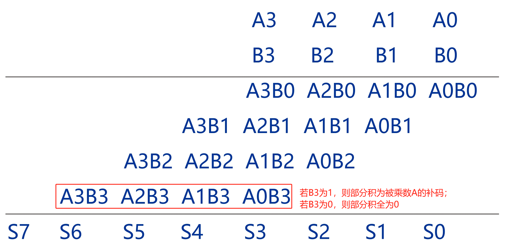

# 基于Booth编码和Wallace树的16位有符号数乘法器
## 1.设计功能与要求


## 2.算法原理
基于Booth编码和Wallace树的16位有符号数乘法器的基本思想是 **逻辑等效** ，采用Booth编码器等效替代传统二进制乘法计算的*部分积产生逻辑*；Wallace树采用多个3-2压缩器构成的树形连接等效替代*串行阵列加法器*。

### 2.1 无符号数二进制乘法
设4位无符号数乘法器的输入被乘数A={A3,A2,A1,A0}、乘数B={B3,B2,B1,B0}，输出乘积S={S7,S6,S5,S4,S3,S2,S1,S0}，则乘法计算过程如下图所示，分为部分积生成、部分积累加两个阶段。


### 2.2 有符号数二进制乘法
设4位有符号数乘法器的输入被乘数A={A3,A2,A1,A0}、乘数B={B3,B2,B1,B0}，输出乘积S={S7,S6,S5,S4,S3,S2,S1,S0}，其中最高位A3和B3都是符号位。有符号数和无符号数的二进制乘法的区别在于最后一个部分积生成，若B3为1则部分积为被乘数A的补码，B3为0则部分积全为0。

**×(-1)等效为求补**：由于有符号数相比无符号数扩展了符号位，最高位的运算可能是带有负号的，最后一个部分积的生成变成了求补运算。以19为例，其补码为8'b0001_0011，由于19×(-1)=-19，而-19的补码表示为8'b1110_1101，恰好为19的补码求补的结果。上述例子表明二进制乘法中×(-1)相当于求补运算。

以(-7)×(-7)为例列解有符号数乘法如下图所示，与无符号数乘法区别在于最后一个部分积的产生和累加时的符号位扩展。


### 2.3 阵列乘法器
在明确2.1和2.2小节二进制乘法运算规则后可得最经典的阵列乘法器结构，4位无符号数的阵列乘法器如下图所示。

从图中可以看到，使用与门实现部分积的生成，然后使用阵列加法器实现部分积的累加。这种乘法器结构虽然简单直接，但是使用较大加法器阵列，延时路径上既有进位延迟，又有求和延迟，可能存在多条延时几乎相同的关键路径，其性能欠佳。

### 2.4 Booth编码
随着乘法器输入数据位宽的增加，阵列乘法器中所需要的与门和全加器数量也随着剧增，关键路径的延迟也相应增加。Booth编码通过编码表的方式避免按位与操作，节省了电路面积，并能够在一定程度上降低非零部分积的数量。其原理推导如下。

一个$N$位二进制数$B$的补码表示为：
$B=-B[N-1]\cdot {{2}^{N-1}}+\sum\limits_{i=0}^{N-2}{B[i]\cdot {{2}^{i}}}$

上式可以展开为：

$=-B[N-1]\cdot {{2}^{N-1}}+B[N-2]\cdot {{2}^{N-2}}+B[N-3]\cdot {{2}^{N-3}}+\ldots +B[2]\cdot {{2}^{2}}+B[1]\cdot {{2}^{1}}+B[0]\cdot {{2}^{0}}$

将其拆分并重组为：

$=-B[N-1]\cdot {{2}^{N-1}}+(2B[N-2]-B[N-2])\cdot {{2}^{N-2}}+(2B[N-3]-B[N-3])\cdot {{2}^{N-3}}+\ldots +(2B[2]-B[2])\cdot {{2}^{2}}+(2B[1]-B[1])\cdot {{2}^{1}}+(2B[0]-B[0])\cdot {{2}^{0}}$

$=(-B[N-1]+B[N-2])\cdot {{2}^{N-1}}+(-B[N-2]+B[N-3])\cdot {{2}^{N-2}}+(-B[N-3]+B[N-4])\cdot {{2}^{N-3}}+\ldots \ldots +(-B[2]+B[1])\cdot {{2}^{2}}+(-B[1]+B[0])\cdot {{2}^{1}}+(-B[0]+B[-1])\cdot {{2}^{0}}$

最终得到如下等式，其中设$B[-1]=0$：

$=\sum\limits_{i=0}^{N-1}{(-B[i]+B[i-1])\cdot {{2}^{i}}}$

有符号二进制数的乘法可以表示为：

$A\times B=\sum\limits_{i=0}^{N-1}{A[i]\times (-B[i]+B[i-1])\cdot {{2}^{i}}}$

因而部分积的产生可以从以下Booth编码表获得：

|$B[i]B[i-1]$|$-B[i]+B[i-1]$|部分积 |
|------------|--------------|------|
| 00 |  0 |  0 |
| 01 |  1 |  A |
| 11 |  0 |  0 |
| 10 | -1 | -A |

正如2.2小节中推到的那样，编码表中部分积为-A相当于对A求补码。仍然以(-7)×(-7)为例列解有符号数乘法的Booth编码实现，其计算过程如下图所示，首先在最低位右侧加入$B[-1]=0$，然后每两位取$B[i]B[i-1]$并通过Booth编码表得到对应的部分积，最后将进行符号位扩展之后的部分积累加就可以得到最终的乘积。


上述Booth编码仅仅消除了与运算，节省了与门阵列的电路面积，但是并没有减少部分和的数量，因此加法器阵列电路面积不变，在实际应用时通常采用以下改进的Booth编码。

$B=-B[N-1]\cdot {{2}^{N-1}}+\sum\limits_{i=0}^{N-2}{B[i]\cdot {{2}^{i}}}$

$=(-B[N-1]+B[N-2])\cdot {{2}^{N-1}}+(-B[N-2]+B[N-3])\cdot {{2}^{N-2}}+(-B[N-3]+B[N-4])\cdot {{2}^{N-3}}+\ldots \ldots +(-B[2]+B[1])\cdot {{2}^{2}}+(-B[1]+B[0])\cdot {{2}^{1}}+(-B[0]+B[-1])\cdot {{2}^{0}}$

$=(-2B[N-1]+B[N-2]+B[N-3])\cdot {{2}^{N-2}}+(-2B[N-3]+B[N-4]+B[N-5])\cdot {{2}^{N-4}}+\ldots \ldots +(-2B[3]+B[2]+B[1])\cdot {{2}^{2}}+(-2B[1]+B[0]+B[-1])\cdot {{2}^{0}}$

$=\sum\limits_{i=0}^{\frac{N}{2}-1}{(-2B[2i+1]+B[2i]+B[2i-1])\cdot {{2}^{2i}}}$

其中$B[-1]=0$，由于${{2}^{2}}=4$，因此这种Booth编码也被称为基4-Booth编码，而之前所介绍的是基2-Booth编码。

借助基4-Booth编码，有符号二进制数的乘法可以写为：

$A\times B=\sum\limits_{i=0}^{\frac{N}{2}-1}{A[2i]\times (-2B[2i+1]+B[2i]+B[2i-1])\cdot {{2}^{2i}}}$

因而部分积的产生可以从以下Booth编码表获得：

|$B[2i+1]B[2i]B[2i-1]$|$-2B[2i+1]+B[2i]+B[2i-1]$|部分积 |
|---------------------|-------------------------|------|
| 000 |  0 |   0 |
| 001 |  1 |   A |
| 010 |  1 |   A |
| 011 |  2 |  2A |
| 100 | -2 | -2A |
| 101 | -1 |  -A |
| 110 | -1 |  -A |
| 111 |  0 |   0 |

编码表中部分积为-A相当于对A求补码、2A相当于对A左移1位、-2A相当于先对A左移1位然后求补。仍然以(-7)×(-7)为例列解有符号数乘法的Booth编码实现，其计算过程如下图所示，首先在最低位右侧加入$B[-1]=0$，然后每三位取$B[2i+1]B[2i]B[2i-1]$并通过Booth编码表得到对应的部分积，最后将进行符号位扩展之后的部分积累加就可以得到最终的乘积。

从图中可以看出，采用基4-Booth编码可以有效减少部分积的数量，但是需要注意部分积累加时的偏移由1位变成了2位。

### 2.5 Wallace树
全加器示意图如下图所示。Wallace树通过多个全加器(又称为3-2压缩器，因为全加器输入三个数据$C_{in}$、$A$、$B$，输出两个数据$C_{out}$、$S$)所构成的树形连接替代规模庞大的串行阵列加法器，能够缩短累加计算时间。


当输入为16位有符号数时，基4-Booth编码具有8项部分积，因而只需要经历4级压缩就可以得到2行长度为32的部分积，最后可以通过32位超前进位加法器得到最终的32位乘积。Wallace树压缩过程如下图所示。

- Wallace树第一级：使用两组、每组32个全加器将8行部分积压缩为6行部分积；
- Wallace树第二级：使用两组、每组32个全加器将6行部分积压缩为4行部分积；
- Wallace树第三级：使用一组、每组32个全加器将4行部分积压缩为3行部分积；
- Wallace树第四级：使用一组、每组32个全加器将3行部分积压缩为2行部分积；

通过上述描述可知，共需要六组、每组32个全加器组成Wallace树。

### 2.6 基于Booth编码和Wallace树的16位有符号数乘法器
基于Booth编码和Wallace树的16位有符号数乘法器框架如下图所示，将模块分为Booth编码模块、部分积生成模块、Wallace树模块、超前进位加法器模块，其中Wallace树模块由六组、每组32个全加器组成。


综上所述，我们明确了构建基于Booth编码和Wallace树的16位乘法器所需的所有模块的基本原理，下面将进行RTL实现。

## 3.RTL实现
### 3.1 Booth编码器模块
Booth编码器负责接受乘数B每三位信号，根据基4-Booth编码得到输出控制信号zero(部分积为零)、one(被乘数不变)、two(被乘数左移)、neg1(被乘数取反+1)、neg2(被乘数左移取反+1)。根据2.4小节中对基4-Booth编码推导介绍很容易编写Verilog代码如下。
```verilog
module BoothEncoder(
    input [2:0] code,
    output zero,// 部分积为零
    output one, // 被乘数不变s
    output two, // 被乘数左移
    output neg1,// 被乘数取反+1
    output neg2 // 被乘数左移取反+1
    );
    assign zero = (code[2]&&code[1]&&code[0]) || ((!code[2])&&(!code[1])&&(!code[0]));
    assign one = ((!code[2])&&(!code[1])&&code[0]) || ((!code[2])&&code[1]&&(!code[0]));
    assign two = (!code[2])&&code[1]&&code[0];
    assign neg1 = (code[2]&&(!code[1])&&code[0]) || (code[2]&&code[1]&&(!code[0]));
    assign neg2 = code[2]&&(!code[1])&&(!code[0]);
endmodule
```

### 3.2 部分积生成模块
部分积生成模块负责接受Booth编码器产生的控制信号和被乘数，计算产生相应的部分积，根据2.4小节的介绍可得Verilog代码如下。
```verilog
module PartialGen(
    input [15:0] A,
    input zero,// 部分积为零
    input one, // 被乘数不变s
    input two, // 被乘数左移
    input neg1,// 被乘数取反+1
    input neg2,// 被乘数左移取反+1
    output [31:0] partial
    );
    // 声明内部信号
    reg [31:0] partial_reg;

    // 产生逻辑
    always @(*) begin
        if(zero)begin
            partial_reg = 32'd0;
        end
        else if(one)begin
            partial_reg = {{16{A[15]}}, A};
        end
        else if(two)begin
            partial_reg = {{15{A[15]}}, A, 1'b0};
        end
        else if(neg1)begin
            partial_reg = ~{{16{A[15]}}, A} + 1'b1;
        end
        else if(neg2)begin
            partial_reg = ~{{15{A[15]}}, A, 1'b0} + 1'b1;
        end
        else begin
            partial_reg = 32'd0;
        end
    end

    // 输出
    assign partial = partial_reg;

endmodule
```

### 3.3 Wallace树模块
根据2.5小节中的介绍，Wallace树由六组、每组32个全加器组成，其中全加器Verilog代码如下。
```verilog
module FullAdder(
    input A,
    input B,
    input Cin,
    output S,
    output Cout
    );
    assign S = A ^ B ^ Cin;
    assign Cout = A&B | (Cin & (A^B));
endmodule
```
每组由32个全加器组成，其Verilog代码如下。
```verilog
module CarrySerialAdder#(
    parameter WIDTH = 32
)(
    input [WIDTH-1:0]op1,
    input [WIDTH-1:0]op2,
    input [WIDTH-1:0]op3,
    output [WIDTH-1:0]S,
    output [WIDTH-1:0]C
    );
    
    genvar i;
    generate
        for (i = 0; i<WIDTH ;i=i+1) begin
            FullAdder  FullAdder_inst (
                .A(op1[i]),
                .B(op2[i]),
                .Cin(op3[i]),
                .S(S[i]),
                .Cout(C[i])
            );
        end
    endgenerate

endmodule
```
Wallace树生成的两行部分积通过超前进位加法器计算得到，该加法器详细介绍请看往期博客：
#### [【数字IC】32位超前进位加法器](https://blog.csdn.net/LionelZhao/article/details/145210010 "【数字IC】32位超前进位加法器")

最终的Wallace树模块由6组CarrySerialAdder组成，Verilog代码如下。
```verilog
module WallaceTreeAdder(
    input [31:0] partial_in0,
    input [31:0] partial_in1,
    input [31:0] partial_in2,
    input [31:0] partial_in3,
    input [31:0] partial_in4,
    input [31:0] partial_in5,
    input [31:0] partial_in6,
    input [31:0] partial_in7,
    output [31:0] product_out
    );
    localparam CSA_WIDTH = 32; 

    // 声明内部信号
    wire [31:0] partial_shift_0;
    wire [31:0] partial_shift_1;
    wire [31:0] partial_shift_2;
    wire [31:0] partial_shift_3;
    wire [31:0] partial_shift_4;
    wire [31:0] partial_shift_5;
    wire [31:0] partial_shift_6;
    wire [31:0] partial_shift_7;
    wire [31:0] S_L0_0, C_L0_0;
    wire [31:0] S_L0_1, C_L0_1;
    wire [31:0] S_L1_0, C_L1_0;
    wire [31:0] S_L1_1, C_L1_1;
    wire [31:0] S_L2_0, C_L2_0;
    wire [31:0] S_L3_0, C_L3_0;
    wire [32:0] Sum;
    

    // 输入部分积位移
    assign partial_shift_0 = partial_in0;
    assign partial_shift_1 = partial_in1 << 2;
    assign partial_shift_2 = partial_in2 << 4;
    assign partial_shift_3 = partial_in3 << 6;
    assign partial_shift_4 = partial_in4 << 8;
    assign partial_shift_5 = partial_in5 << 10;
    assign partial_shift_6 = partial_in6 << 12;
    assign partial_shift_7 = partial_in7 << 14;


    // CarrySerialAdder实例
    // Level 0
    CarrySerialAdder # (
        .WIDTH(CSA_WIDTH)
    )CarrySerialAdder_l0_0 (
        .op1(partial_shift_0),
        .op2(partial_shift_1),
        .op3(partial_shift_2),
        .S(S_L0_0),
        .C(C_L0_0)
    );

    CarrySerialAdder # (
        .WIDTH(CSA_WIDTH)
    )CarrySerialAdder_l0_1 (
        .op1(partial_shift_3),
        .op2(partial_shift_4),
        .op3(partial_shift_5),
        .S(S_L0_1),
        .C(C_L0_1)
    );

    // Level 1
    CarrySerialAdder # (
        .WIDTH(CSA_WIDTH)
    )CarrySerialAdder_l1_0 (
        .op1(S_L0_0),
        .op2({C_L0_0[30:0], 1'b0}),
        .op3(S_L0_1),
        .S(S_L1_0),
        .C(C_L1_0)
    );

    CarrySerialAdder # (
        .WIDTH(CSA_WIDTH)
    )CarrySerialAdder_l1_1 (
        .op1({C_L0_1[30:0], 1'b0}),
        .op2(partial_shift_6),
        .op3(partial_shift_7),
        .S(S_L1_1),
        .C(C_L1_1)
    );

    // Level 2
    CarrySerialAdder # (
        .WIDTH(CSA_WIDTH)
    )CarrySerialAdder_l2_0 (
        .op1(S_L1_0),
        .op2({C_L1_0[30:0], 1'b0}),
        .op3(S_L1_1),
        .S(S_L2_0),
        .C(C_L2_0)
    );

    // Level 3
    CarrySerialAdder # (
        .WIDTH(CSA_WIDTH)
    )CarrySerialAdder_l3_0 (
        .op1({C_L1_1[30:0], 1'b0}),
        .op2(S_L2_0),
        .op3({C_L2_0[30:0], 1'b0}),
        .S(S_L3_0),
        .C(C_L3_0)
    );

    // CarryLookHeadAdder实例
    CarryLookHeadAdder  CarryLookHeadAdder_inst (
        .A(S_L3_0),
        .B({C_L3_0[30:0], 1'b0}),
        .Sum(Sum)
    );

    // 产生输出
    assign product_out = Sum[31:0];

endmodule
```
由于部分积生成逻辑并未对其进行偏移，因此在Wallace树模块进行累加前做偏移到正确位置再进行压缩累加。

### 3.4 顶层模块
在顶层模块中例化8个Booth编码器模块、8个部分积生成模块、Wallace树模块并进行连接得到顶层模块的Verilog代码。
```verilog
module mul_tc_16_16(
    input [15:0]a,
    input [15:0]b,
    output [31:0]product
    );
    // 声明内部信号
    wire [2:0]code_0, code_1, code_2, code_3, code_4, code_5, code_6, code_7;
    wire [31:0]partial_0, partial_1, partial_2, partial_3, partial_4, partial_5, partial_6, partial_7;
    wire zero_0, one_0, two_0, neg1_0, neg2_0;
    wire zero_1, one_1, two_1, neg1_1, neg2_1;
    wire zero_2, one_2, two_2, neg1_2, neg2_2;
    wire zero_3, one_3, two_3, neg1_3, neg2_3;
    wire zero_4, one_4, two_4, neg1_4, neg2_4;
    wire zero_5, one_5, two_5, neg1_5, neg2_5;
    wire zero_6, one_6, two_6, neg1_6, neg2_6;
    wire zero_7, one_7, two_7, neg1_7, neg2_7;

    // 产生编码
    assign code_0  = {b[1:0], 1'b0};
    assign code_1  = b[3:1];
    assign code_2  = b[5:3];
    assign code_3  = b[7:5];
    assign code_4  = b[9:7];
    assign code_5  = b[11:9];
    assign code_6  = b[13:11];
    assign code_7  = b[15:13];

    // Booth编码
    BoothEncoder  BoothEncoder_inst0 (
        .code(code_0),
        .zero(zero_0),
        .one(one_0),
        .two(two_0),
        .neg1(neg1_0),
        .neg2(neg2_0)
    );

    BoothEncoder  BoothEncoder_inst1 (
        .code(code_1),
        .zero(zero_1),
        .one(one_1),
        .two(two_1),
        .neg1(neg1_1),
        .neg2(neg2_1)
    );

    BoothEncoder  BoothEncoder_inst2 (
        .code(code_2),
        .zero(zero_2),
        .one(one_2),
        .two(two_2),
        .neg1(neg1_2),
        .neg2(neg2_2)
    );

    BoothEncoder  BoothEncoder_inst3 (
        .code(code_3),
        .zero(zero_3),
        .one(one_3),
        .two(two_3),
        .neg1(neg1_3),
        .neg2(neg2_3)
    );

    BoothEncoder  BoothEncoder_inst4 (
        .code(code_4),
        .zero(zero_4),
        .one(one_4),
        .two(two_4),
        .neg1(neg1_4),
        .neg2(neg2_4)
    );

    BoothEncoder  BoothEncoder_inst5 (
        .code(code_5),
        .zero(zero_5),
        .one(one_5),
        .two(two_5),
        .neg1(neg1_5),
        .neg2(neg2_5)
    );

    BoothEncoder  BoothEncoder_inst6 (
        .code(code_6),
        .zero(zero_6),
        .one(one_6),
        .two(two_6),
        .neg1(neg1_6),
        .neg2(neg2_6)
    );

    BoothEncoder  BoothEncoder_inst7 (
        .code(code_7),
        .zero(zero_7),
        .one(one_7),
        .two(two_7),
        .neg1(neg1_7),
        .neg2(neg2_7)
    );

    // 产生部分积
    PartialGen  PartialGen_inst0 (
        .A(a),
        .zero(zero_0),
        .one(one_0),
        .two(two_0),
        .neg1(neg1_0),
        .neg2(neg2_0),
        .partial(partial_0)
    );

    PartialGen  PartialGen_inst1 (
        .A(a),
        .zero(zero_1),
        .one(one_1),
        .two(two_1),
        .neg1(neg1_1),
        .neg2(neg2_1),
        .partial(partial_1)
    );

    PartialGen  PartialGen_inst2 (
        .A(a),
        .zero(zero_2),
        .one(one_2),
        .two(two_2),
        .neg1(neg1_2),
        .neg2(neg2_2),
        .partial(partial_2)
    );

    PartialGen  PartialGen_inst3 (
        .A(a),
        .zero(zero_3),
        .one(one_3),
        .two(two_3),
        .neg1(neg1_3),
        .neg2(neg2_3),
        .partial(partial_3)
    );

    PartialGen  PartialGen_inst4 (
        .A(a),
        .zero(zero_4),
        .one(one_4),
        .two(two_4),
        .neg1(neg1_4),
        .neg2(neg2_4),
        .partial(partial_4)
    );

    PartialGen  PartialGen_inst5 (
        .A(a),
        .zero(zero_5),
        .one(one_5),
        .two(two_5),
        .neg1(neg1_5),
        .neg2(neg2_5),
        .partial(partial_5)
    );

    PartialGen  PartialGen_inst6 (
        .A(a),
        .zero(zero_6),
        .one(one_6),
        .two(two_6),
        .neg1(neg1_6),
        .neg2(neg2_6),
        .partial(partial_6)
    );

    PartialGen  PartialGen_inst7 (
        .A(a),
        .zero(zero_7),
        .one(one_7),
        .two(two_7),
        .neg1(neg1_7),
        .neg2(neg2_7),
        .partial(partial_7)
    );

    // 部分积累加
    WallaceTreeAdder  WallaceTreeAdder_inst (
        .partial_in0(partial_0),
        .partial_in1(partial_1),
        .partial_in2(partial_2),
        .partial_in3(partial_3),
        .partial_in4(partial_4),
        .partial_in5(partial_5),
        .partial_in6(partial_6),
        .partial_in7(partial_7),
        .product_out(product)
    );


endmodule
```

Vivado RTL analysis结果如下图所示，可以符合设计预期。
### 顶层模块
可以看出顶层模块连接关系正确。

### Booth编码器模块

### 部分积生成

### Wallace树


## 4.RTL仿真结果
### 4.1 测试用例1：输入16'b0110000010000000（十进制24704）和16’b1000000000000001（十进制-32767），输出32’b11001111110000000110000010000000（十进制-809475068）。


### 4.2 测试用例2：采用$random系统函数随机生成16位乘数和被乘数，并计算预期乘积并与乘法器仿真结果对比。
仿真波形如下：其中right_flag=(product==expected_product)?1’b1:1’b0;用于对比预期输出和乘法器仿真输出。

从波形可以看出本文的基于Booth编码和Wallce树的乘法器设计功能正确。

# 参考与致谢
#### 1. 《高等数字集成电路分析与设计》第5章PPT，中国科学院大学
#### 2. [【IC设计】【前端到后端全流程】【基于Booth2算法的32位乘法器】3-Booth算法与Booth2算法讲解以及RTL设计](https://www.bilibili.com/video/BV1s84y1W72L/?spm_id_from=333.337.search-card.all.click&vd_source=c0a67d78218a5e3a4a7eb4d3591de45c "【IC设计】【前端到后端全流程】【基于Booth2算法的32位乘法器】3-Booth算法与Booth2算法讲解以及RTL设计")
#### 3. [【HDL系列】乘法器(6)——Radix-4 Booth乘法器](https://zhuanlan.zhihu.com/p/143802580 "【HDL系列】乘法器(6)——Radix-4 Booth乘法器")
#### 4. [【HDL系列】乘法器(4)——图解Wallace树](https://zhuanlan.zhihu.com/p/130968045 "【HDL系列】乘法器(4)——图解Wallace树")


# 写在最后
2025年1月上旬总算结束了研一上学期繁忙的课程，总算有时间整理总结UCAS《高等数字集成电路分析与设计》课程中老师所布置的作业题，作为老师上课来不及仔细讲解内容的补充，也作为以后自己复习的参考。笔者作为初学者难免出现错误，请读者多多批评指正，也希望看到本博客的学弟学妹多多思考、不要盲目抄袭。

# 源码
verilog源码开源在：[lionelZhaowy/Digital-IC-Analysis-and-Design](https://github.com/lionelZhaowy/Digital-IC-Analysis-and-Design.git "lionelZhaowy/Digital-IC-Analysis-and-Design")

**作者：LionelZhao 欢迎转载，主动输出、与人分享是进步的源泉！！！**

**转载请保留原文地址：[lionelZhaowy/Digital-IC-Analysis-and-Design](https://github.com/lionelZhaowy/Digital-IC-Analysis-and-Design.git "lionelZhaowy/Digital-IC-Analysis-and-Design")**

**创作不易，如果觉得本文对您有帮助欢迎读者客官多多打赏！！！**


工程文件请在海鲜市场购买。
