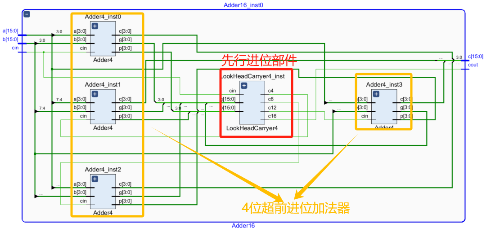
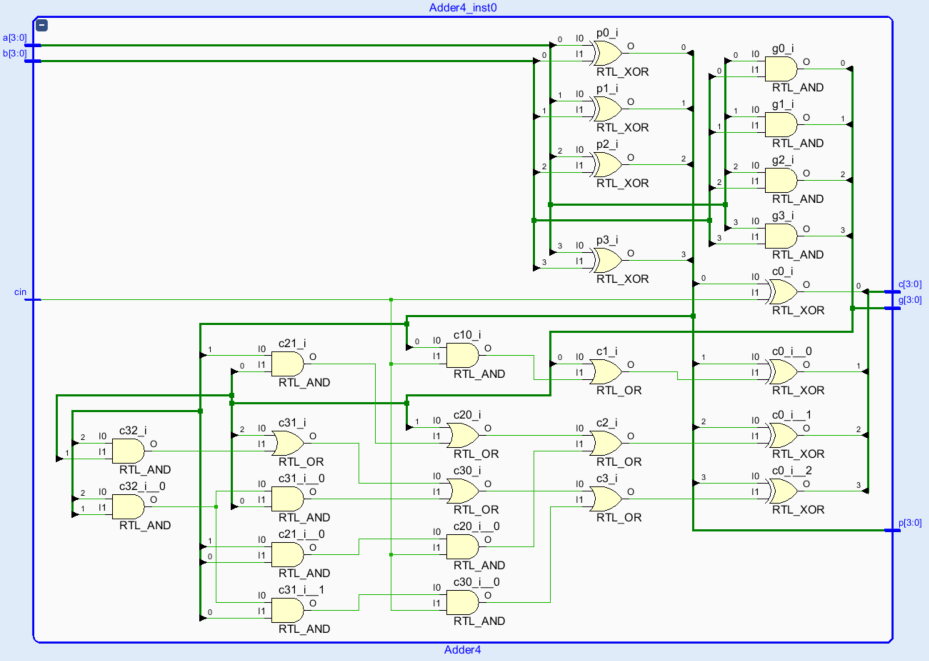

# 32位整数超前进位加法器
## 1.设计功能与要求


## 2.算法原理
超前进位加法器的基本思想是 **逻辑表达式展开** 。
### 2.1 1bit全加器逻辑
设1bit全加器的输入加数和被加数为A和B、输入进位为Cin，输出和为S、输出进位为Cout，则真值表如下所示。

通过真值表得出全加器的和、进位的逻辑表达式如下。

$S=A\otimes B\otimes C_{in}$

$C_{out}=AB+(A\otimes B)C_{in}$

### 2.2 4位串行进位加法器
4bit串行进位加法器由四个全加器级联得到，其原理图如下图所示，由于进位逻辑链过长，高位加法器需要等低位加法器进位逻辑计算完成之后才能够得到数据进行计算，因此计算延时大。


### 2.3 4位超前进位加法器
通过观察2.2小节钟的表达式发现，当$AB$为1时$C_{out}$就已经可以确定为1，当$A\otimes B$为1时$C_{out}$和$S$的值为$C_{in}$，因此设变量$G=AB$为进位产生信号(G为Generate的缩写)、变量$P=A\otimes B$为进位传播信号(P为Propagate的缩写)，上述表达式可以写为。

$S=P\otimes C_{in}$

$C_{out}=G+PC_{in}$

由于在输入数值确定时输出就已经可以确定了，不需要等到进位信号传播就能够直接计算，因此将4bit加法的进位逻辑表达式展开得到以下公式。

$C_{-1}=C_{in}$

$C_0=G_0+P_0C_{-1}=G_0+P_0С_{іп}$

$C_1=G_1+P_1C_0=G_1+P_1G_0+P_1P_0С_{іп}$

$C_2=G_2+P_2C_1=G_2+P_2G_1+P_2P_1G_0+P_2P_1P_0С_{іп}$

$C_3=G_3+P_3C_2=G_3+P_3G_2+P_3P_2G_1+P_3P_2P_1G_0+P_3P_2P_1P_0C_{in}$
通过上述公式，首先通过输入$A$和$B$得到进位产生信号$G$和进位传播信号$P$，然后通过$C_{in}$、$G$、$P$就可以直接计算得到进位信号。通过将逻辑表达式展开的方式可以缩短进位传播带来的延迟，提高计算速度，但是信号扇出较大。在实际设计中通常采用4bit位宽超前进位加法器拼接组成32bit超前进位加法器。

### 2.4 先行进位部件
在使用4bit超前进位加法器组成16bit超前进位加法器的过程中，需要要额外的先行进位部件来生成高bit位的4bit超前进位加法器的进位信号，其结构示意图如下图所示。图中CLA4代表4位超前进位加法器(Carry Look Ahead Adder)、CG代表进位产生(Carry Generate)逻辑，信号c4、c8、c12分别是处理[7:4]、[11:8]、[15:12]信号的输入进位。

从图中可以看出，四个4bit超前进位加法器将进位产生/传播信号G和P也一起输出并合并为16bit信号送入进位产生模块。

对于先行进位部件逻辑的推理与超前进位加法器相同，进位$C_3$可以写成 $C_{m3}=G_{m3}+P_{m3}C_{in}$，可以得到以下表达式。

组进位产生信号：$G_{m3}=G_3+P_3G_2+P_3P_2G_1+P_3P_2P_1G_0$

组进位传播信号：$P_{m3}=P_3P_2P_1P_0$

同理可得以下表达式：

$C_{m7}=G_{m7}+P_{m7}C_{m3}$

$C_{m11}=G_{m11}+P_{m11}C_{m7}$

$C_{m15}=G_{m15}+P_{m15}C_{m11}$

其中组进位产生信号表达式为：

$G_{m7}=G_7+P_7G_6+P_7P_6G_5+P_7P_6P_5G_4$

$G_{m11}=G_{11}+P_{11}G_{10}+P_{11}P_{10}G_9+P_{11}P_{10}P_9G_8$

$G_{m15}=G_{15}+P_{15}G_{14}+P_{15}P_{14}G_{13}+P_{15}P_{14}P_{13}G_{12}$

其中组进位传播信号表达式为：

$P_{m7}=P_7P_6P_5P_4$

$P_{m11}=P_{11}P_{10}P_9P_8$

$P_{m15}=P_{15}P_{14}P_{13}P_{12}$


### 2.5 32位超前进位加法器
在2.3小节中介绍了4位超前进位加法器、2.4小节中介绍了先行进位部件之后，已经可以搭建出16位超前进位加法器了。本设计使用两个16位超前进位加法器搭建32位超前进位加法器，直接将低16位的输出进位信号输入到高16位超前进位加法器的输入进位即可完成连接。（*在此需要注意进位信号来源于进位产生模块，是直接通过输入信号计算而来的，仍然属于超前进位不属于行波进位。*）

综上所述，我们明确了构建32位超前进位加法器所需所有模块的基本原理，下面将进行RTL实现。

## 3.RTL实现
### 3.1 4位超前进位加法器
根据2.3小节中对4位超前进位加法器逻辑表达式的推导介绍很容易编写Verilog代码如下。
```verilog
module Adder4(
    input [3:0]a,
    input [3:0]b,
    input cin,
    output [3:0]s,
    // output cout,
    output [3:0]p,
    output [3:0]g
    );
    // 声明内部信号
    wire c0, c1, c2, c3;
    wire p0, p1, p2, p3;
    wire g0, g1, g2, g3;

    // 进位产生信号
    assign g0 = a[0] & b[0];
    assign g1 = a[1] & b[1];
    assign g2 = a[2] & b[2];
    assign g3 = a[3] & b[3];

    // 进位传递信号
    assign p0 = a[0] ^ b[0];
    assign p1 = a[1] ^ b[1];
    assign p2 = a[2] ^ b[2];
    assign p3 = a[3] ^ b[3];

    // 进位信号
    assign c0 = cin;
    assign c1 = g0 | p0&c0;
    assign c2 = g1 | p1&g0 | p1&p0&c0;
    assign c3 = g2 | p2&g1 | p2&p1&g0 | p2&p1&p0&c0;

    // 和信号
    assign s[0] = p0 ^ c0;
    assign s[1] = p1 ^ c1;
    assign s[2] = p2 ^ c2;
    assign s[3] = p3 ^ c3;

    // 输出进位产生信号和传播信号
    assign p = {p3,p2,p1,p0};
    assign g = {g3,g2,g1,g0};

endmodule
```

### 3.2 先行进位部件
根据2.4小节中对先行进位部件逻辑表达式的推导介绍很容易编写Verilog代码如下。
```verilog
module LookHeadCarryer4(
    input [15:0]p,
    input [15:0]g,
    input cin,
    output c4,
    output c8,
    output c12,
    output c16
    );
    // 内部信号声明
    wire pm0, pm1, pm2, pm3;
    wire gm0, gm1, gm2, gm3;

    // 进位产生/传播信号
    assign pm0 = p[3]  & p[2]  & p[1]  & p[0];
    assign pm1 = p[7]  & p[6]  & p[5]  & p[4];
    assign pm2 = p[11] & p[10] & p[9]  & p[8];
    assign pm3 = p[15] & p[14] & p[13] & p[12];
    assign gm0 = g[3]  | p[3]&g[2]   | p[3]&p[2]&g[1]    | p[3]&p[2]&p[1]&g[0];
    assign gm1 = g[7]  | p[7]&g[6]   | p[7]&p[6]&g[5]    | p[7]&p[6]&p[5]&g[4];
    assign gm2 = g[11] | p[11]&g[10] | p[11]&p[10]&g[9]  | p[11]&p[10]&p[9]&g[8];
    assign gm3 = g[15] | p[15]&g[14] | p[15]&p[14]&g[13] | p[15]&p[14]&p[13]&g[12];

    // 进位信号
    assign c4  = gm0 | pm0 & cin;
    assign c8  = gm1 | pm1 & c4;
    assign c12 = gm2 | pm2 & c8;
    assign c16 = gm3 | pm3 & c12;

endmodule
```

### 3.3 16位超前进位加法器
根据2.4小节中的原理图很容易边下以下Verilog代码：
```verilog
module Adder16(
    input [15:0]a,
    input [15:0]b,
    input cin,
    output [15:0]s,
    output cout
    );
    // 声明内部信号
    wire c4, c8, c12, c16;
    wire [15:0] p, g;
   
    // 4位加法器实例
    Adder4  Adder4_inst0 (
        .a(a[3:0]),
        .b(b[3:0]),
        .cin(cin),
        .s(s[3:0]),
        // .cout(),
        .p(p[3:0]),
        .g(g[3:0])
    );
    Adder4  Adder4_inst1 (
        .a(a[7:4]),
        .b(b[7:4]),
        .cin(c4),
        .s(s[7:4]),
        // .cout(),
        .p(p[7:4]),
        .g(g[7:4])
    );
    Adder4  Adder4_inst2 (
        .a(a[11:8]),
        .b(b[11:8]),
        .cin(c8),
        .s(s[11:8]),
        // .cout(),
        .p(p[11:8]),
        .g(g[11:8])
    );
    Adder4  Adder4_inst3 (
        .a(a[15:12]),
        .b(b[15:12]),
        .cin(c12),
        .s(s[15:12]),
        // .cout(),
        .p(p[15:12]),
        .g(g[15:12])
    );

    // 进位链信号产生实例
    LookHeadCarryer4  LookHeadCarryer4_inst (
        .p(p),
        .g(g),
        .cin(cin),
        .c4(c4),
        .c8(c8),
        .c12(c12),
        .c16(c16)
    );

    assign cout = c16;

endmodule
```

### 3.4 32位超前进位加法器
根据2.5小节中的介绍很容易编写以下Verilog代码：
```verilog
module CarryLookHeadAdder(
    input [31:0]A,
    input [31:0]B,
    output [32:0]Sum
    );

    // 声明内部信号
    wire c16;

    // 16位超前进位加法器实例
    Adder16  Adder16_inst0 (
        .a(A[15:0]),
        .b(B[15:0]),
        .cin(1'b0),
        .s(Sum[15:0]),
        .cout(c16)
    );
    Adder16  Adder16_inst1 (
        .a(A[31:16]),
        .b(B[31:16]),
        .cin(c16),
        .s(Sum[31:16]),
        .cout(Sum[32])
    );

endmodule
```

Vivado RTL analysis结果如下图所示，可以符合设计预期。
### 32位超前进位加法器
可以看出32位超前进位加法器模块连接关系正确。

### 16位超前进位加法器
可以看出16位超前进位加法器模块连接关系正确。

### 4位超前进位加法器
可以看出4位超前进位加法器模块连接关系正确。

### 先行进位部件
可以看出先行进位部件模块符合设计预期。


## 4.RTL仿真结果
本设计的测试平台除了使用几个特殊的测试用例之外，还使用$random随机生成32位加数和被加数，然后计算得到预期和与加法器仿真结果做对比，关键testbench代码如下：
```verilog
    assign Sum_expect = A+B;
    assign flag = (Sum==Sum_expect)?1'b1:1'b0;

    initial begin
        i = 0;
        A = $signed(32'd65535);
        B = $signed(32'd65535);
        #100;
        A = $signed(32'd1);
        B = $signed(-32'd65535);
        #100;
        A = $signed(-32'd1);
        B = $signed(-32'd65535);
        for(i=0; i<10; i=i+1)begin
            #100;
            A = $random;
            B = $random;
        end
        #100;
        $stop;
   end
```
仿真波形如下：

从波形可以看出32位超前进位加法器功能正确。

# 参考与致谢
#### [verilog 实现32位加法器（超前进位）](https://blog.csdn.net/qq_39507748/article/details/108911941 "verilog 实现32位加法器（超前进位）")。


# 写在最后
2025年1月上旬总算结束了研一上学期繁忙的课程，总算有时间整理总结UCAS《高等数字集成电路分析与设计》课程中老师所布置的作业题，作为老师上课来不及仔细讲解内容的补充，也作为以后自己复习的参考。笔者作为初学者难免出现错误，请读者多多批评指正，也希望看到本博客的学弟学妹多多思考、不要盲目抄袭。

# 源码
verilog源码开源在：[lionelZhaowy/Digital-IC-Analysis-and-Design](https://github.com/lionelZhaowy/Digital-IC-Analysis-and-Design.git "lionelZhaowy/Digital-IC-Analysis-and-Design")

**作者：LionelZhao 欢迎转载，主动输出、与人分享是进步的源泉！！！**

**转载请保留原文地址：[lionelZhaowy/Digital-IC-Analysis-and-Design](https://github.com/lionelZhaowy/Digital-IC-Analysis-and-Design.git "lionelZhaowy/Digital-IC-Analysis-and-Design")**

**创作不易，如果觉得本文对您有帮助欢迎读者客官多多打赏！！！**


工程文件请在海鲜市场购买。
