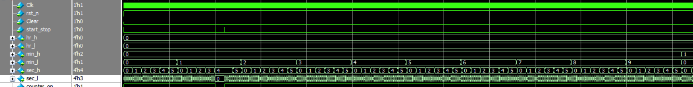

# 跑表
## 1.设计功能与要求


## 2.算法原理
本设计采用 **模块化** 实现。
### 2.1 级联计数器
跑表本质上是三个计数器（小时计数器、分钟计数器、秒钟计数器）的级联，小时计数器的模为12（显示的数值范围为0~11）、分钟和秒钟计数器的模为60（显示的数值范围是0~59）。由于小时、分钟、秒钟的数值要通过数码管显示，因此本设计使用8位BCD码表示，高4位和第4位分别代表数值的十位和个位，通过低4位是否达到数值9来控制其清零和高4位的自+1。
### 2.2 计数分频
根据题目中主时钟频率为10MHz的条件，需要使用计数器分频得到1Hz时钟来驱动三个计数器，并通过秒钟计数器的记满信号（如({sec_h, sec_l}==8'h59)?1'b1:1'b0;）来实现分钟计数器使能、秒钟计数器和分钟计数器的记满信号来实现小时计数器的使能。由10MHz/1Hz=10,000,000可得接受10MHz时钟的计数器需要记满10,000,000才可以产生1Hz信号，由于一个时钟脉冲分为高电平时间和低电平时间，因此每个电平各记满5,000,000即可，其示意图如下。


### 2.3 上升沿/下降沿检测
由于题目中要求使用一个按键start_stop来实现跑表的开始和暂停功能，这里有两种控制逻辑（假设独立按键按下为高电平、松开为低电平）：
- 1.start_stop按下为跑表计时状态，松开为跑表暂停状态，这种控制逻辑只需要在always块的if-else语句中直接使用start_stop作为时/分/秒计数器自加一的使能就能够使实现。
- 2.按下start_stop再松开为跑表计时状态，下一次按下start_stop再松开为跑表暂停状态，这种控制逻辑需要使用上升沿/下降沿检测实现对时/分/秒计数器自加一的使能控制，其实例代码和对应的波形图如下。
```verilog
	// 声明上升沿/下降沿检测信号
	wire pos_flag, neg_flag;
	// 声明暂存寄存器
	reg din_reg1, din_reg2;

	// 寄存器暂存
	always @(posedge Clk) begin
		din_reg1 <= din;
		din_reg2 <= din_reg1;
    end

	// 上升沿检测
    assign pos_flag = (~din_reg2) && din_reg1;
	// 下降沿检测
    assign neg_flag = (~din_reg1) && din_reg2;
```

通过pos_flag或neg_flag来控制使能信号的翻转即可实现控制逻辑2。

### 2.4 数码管驱动逻辑
本设计需要使用6位8段数码管进行小时/分钟/秒钟的数值显示，每个数值由2个4位BCD码组成，因此需要6位数码管，其实物如下图所示。


常见的8段数码管电路原理图如下图所示，图（a）为数码管物理结构与管脚编号的映射，图（b）为常见的两种数码管电路原理图，其中左边为共阴极数码管，右边为共阳极数码管。

对于共阴极数码管，输入高电平信号才可以点亮对应的LED；对于共阳极数码管，输入低电平信号才可以点亮对应的数码管。4位二进制数到数码管显示的查找表被称为**段码表**，常见的共阴极数码管和共阳极数码管的段码表示意图如下。


当需要显示多位数码管时，如果每一位数字都使用一个芯片管脚来驱动8段数码管是十分浪费的，利用人眼的*视觉暂留*效应来进行**动态扫描**。例如直接驱动6位8段数码管需要使用6×8=48个管脚，动态扫描驱动6位8段数码管则需要8+6=14个管脚。本设计所使用的数码管型号3661AS-1的实物参数以及电路原理图如下，需要本设计的驱动电路在某个时间片位选选中某位数码管并送入对应的段码，轮流进行驱动便可以实现动态扫描。

6位8段数码管的动态扫描时序图如下，其中信号sm_bit和sm_seg分别代表数码管的6bit位选信号和8bit段选信号、sel_l/sec_h/min_l/min_h/hr_l/hr_h分别代表秒钟低位/秒钟高位/分钟低位/分钟高位/小时低位/小时高位。

在进行电路设计时，通常使用计数器count来选择位选到哪位数码管，由于视觉暂留效应通常需要对时钟进行分频来驱动count计数器的自加一，否则扫描频率过快则会产生数字重叠、扫描频率过慢则数字会出现闪烁。通过原理图可以看出位选信号为低电平选中，因此sm_bit使用“独冷码”（即独热码的反码，所有bit位只有一位0，其余位都是1）。

### 2.5 按键消抖
本设计中的输入信号Clear、start_stop都来自开发板的独立按键，由于按键簧片在按下和松开时会产生抖动而出现误触造成信号不稳定，因此需要对按键进行消抖。独立按键簧片抖动造成的信号如下图所示。

按键消抖分为软件消抖和硬件消抖两种思路，软件消抖则是通过CPU程序进行延迟后再检测按键信号，硬件消抖则是采用硬件计数器计数再检测按键信号。本设计的按键消抖模块采用三段式状态机实现，其状态转移图如下图所示，其中HIGH/LOW代表高/低电平状态、H2L/L2H代表高/低电平向低/高电平转移的状态（此时计数器cnt计数直到记满拉高cnt_flag，再次检测输入按键信号决定进入HIGH还是LOW状态）。

此外由于输入按键信号key_in相对于电路为异步信号，为避免建立时间违例通常需要使用寄存器对齐打一拍降低时序违例造成的亚稳态风险，使用寄存器打一拍后的信号key_in_d1作为状态机输入信号。

综上所述，我们明确了构建跑表所需所有模块的基本原理，下面将进行RTL实现。

## 3.RTL实现
### 3.1 级联计数器模块
根据2.1小节的介绍很容易编写Verilog代码如下：
```verilog
module Timer(
    input   clk,
    input   rst_n,
    input   en,
    input   Clear,
    output  reg [3:0] hr_h,
    output  reg [3:0] hr_l,
    output  reg [3:0] min_h,
    output  reg [3:0] min_l,
    output  reg [3:0] sec_h,
    output  reg [3:0] sec_l
    );
    // 内部信号
    wire sec_60_flag, min_60_flag, hur_12_flag;//计数满标志位
    wire sec_l_flag, min_l_flag, hur_l_flag;

    // 记满信号
    assign sec_60_flag = ({sec_h, sec_l}==8'h59)?1'b1:1'b0;
    assign min_60_flag = ({min_h, min_l}==8'h59)?1'b1:1'b0;
    assign hur_12_flag = ({hr_h , hr_l }==8'h11)?1'b1:1'b0;
    assign sec_l_flag = (sec_l==4'h9)?1'b1:1'b0;
    assign min_l_flag = (min_l==4'h9)?1'b1:1'b0;
    assign hur_l_flag = (hr_l ==4'h9)?1'b1:1'b0;

    // BCD码计数器控制
    // 秒
    always @(posedge clk or negedge rst_n) begin
        if(!rst_n || Clear)begin
            sec_l <= 4'd0;
        end
        else if(en) begin
            if(sec_l_flag)begin
                sec_l <= 4'd0;
            end
            else begin
                sec_l <= sec_l + 4'd1;
            end
        end
        else begin
            sec_l <= sec_l;
        end
    end

    always @(posedge clk or negedge rst_n) begin
        if(!rst_n || Clear)begin
            sec_h <= 4'd0;
        end
        else if(en)begin
            if(sec_60_flag)begin
                sec_h <= 4'd0;
            end
            else if(sec_l_flag)begin
                sec_h <= sec_h + 4'd1;
            end
            else begin
                sec_h <= sec_h;
            end
        end
        else begin
            sec_h <= sec_h;
        end
    end

    // 分
    always @(posedge clk or negedge rst_n) begin
        if(!rst_n || Clear)begin
            min_l <= 4'd0;
        end
        else if(en) begin
            if(min_l_flag&&sec_60_flag)begin
                min_l <= 4'd0;
            end
            else if(sec_60_flag)begin
                min_l <= min_l + 4'd1;
            end
            else begin
                min_l <= min_l;
            end
        end
        else begin
            min_l <= min_l;
        end
    end
    
    always @(posedge clk or negedge rst_n) begin
        if(!rst_n || Clear)begin
            min_h <= 4'd0;
        end
        else if(en)begin
            if(min_60_flag&&sec_60_flag)begin
                min_h <= 4'd0;
            end
            else if(min_l_flag&&sec_60_flag)begin
                min_h <= min_h + 4'd1;
            end
            else begin
                min_h <= min_h;
            end
        end
        else begin
            min_h <= min_h;
        end
    end

    // 时
    always @(posedge clk or negedge rst_n) begin
        if(!rst_n || Clear)begin
            hr_l <= 4'd0;
        end
        else if(en)begin
            if((hur_12_flag&&min_60_flag&&sec_60_flag) || (hur_l_flag&&min_60_flag&&sec_60_flag))begin
                hr_l <= 4'd0;
            end
            else if(min_60_flag&&sec_60_flag)begin
                hr_l <= hr_l + 4'd1;
            end
            else begin
                hr_l <= hr_l;
            end
        end
        else begin
            hr_l <= hr_l;
        end
    end
    
    always @(posedge clk or negedge rst_n) begin
        if(!rst_n || Clear)begin
            hr_h <= 4'd0;
        end
        else if(en)begin
            if(hur_12_flag&&min_60_flag&&sec_60_flag)begin
                hr_h <= 4'd0;
            end
            else if(hur_l_flag&&min_60_flag&&sec_60_flag)begin
                hr_h <= hr_h + 4'd1;
            end
            else begin
                hr_h <= hr_h;
            end
        end
        else begin
            hr_h <= hr_h;
        end
    end

endmodule
```

### 3.2 时钟分频模块clk_div_1Hz
根据2.2小节的介绍很容易编写Verilog代码如下：
```verilog
module clk_div_1Hz(
    input Clk,
    input rst_n,
    output reg clk_1Hz
    );
    localparam CNT_MAX = 5000000;
    // 内部信号
    reg [22:0] cnt;
    wire cnt_flag;

    assign cnt_flag = (cnt == CNT_MAX-1)?1'b1:1'b0;

    // 计数器控制
    always @(posedge Clk or negedge rst_n) begin
        if(!rst_n)begin
            cnt <= 23'd0;
        end
        else if(cnt_flag)begin
            cnt <= 23'd0;
        end
        else begin
            cnt <= cnt + 23'd1;
        end
    end

    // 分频后时钟
    always @(posedge Clk or negedge rst_n) begin
        if(!rst_n)begin
            clk_1Hz <= 1'b0;
        end
        else if(cnt_flag)begin
            clk_1Hz <= ~clk_1Hz;
        end
        else begin
            clk_1Hz <= clk_1Hz;
        end
    end

endmodule
```

### 3.3 上升沿检测模块posedge_detector
根据2.3小节的介绍很容易编写Verilog代码如下：
```verilog
module posedge_detector(
    input   Clk,
    input   rst_n,
    input   din,
    output  reg dout
    );
    // 内部信号
    reg din_reg1, din_reg2;
    wire pos_flag;

    // din信号上升沿检测
    always @(posedge Clk or negedge rst_n) begin
        if(!rst_n)begin
            din_reg1 <= 1'b0;
            din_reg2 <= 1'b0;
        end
        else begin
            din_reg1 <= din;
            din_reg2 <= din_reg1;
        end
    end

    always @(posedge Clk or negedge rst_n) begin
        if(!rst_n)begin
            dout <= 1'b0;
        end
        else if(pos_flag)begin
            dout <= ~dout;
        end
        else begin
            dout <= dout;
        end
    end

    assign pos_flag = (~din_reg2) && din_reg1;

endmodule
```

### 3.4 数码管驱动模块DigtalTubeDriver
根据2.4小节的介绍很容易编写Verilog代码如下：
```verilog
module DigtalTubeDriver(
    input clk,
    input rst_n,
    input [3:0] hr_h,
    input [3:0] hr_l,
    input [3:0] min_h,
    input [3:0] min_l,
    input [3:0] sec_h,
    input [3:0] sec_l,
    output reg [5:0] sm_bit,
    output reg [7:0] sm_seg
    );
    // 内部信号声明
    reg[18:0]count;//定义计数寄存器

    // 5ms扫描一轮
    always @(posedge clk or negedge rst_n) begin
        if(!rst_n)
            count<=0;
        //for sim
        else if(count == 19'd400000)
            count = 19'd0;
        else
            count = count + 1'b1;
    end	

    always @(posedge clk or negedge rst_n) begin
        if(!rst_n)begin
            sm_bit <= 6'd0;
            sm_seg <= 8'd0;
        end
        else begin
            case (count[13:11])
                3'd0: begin
                    sm_bit <= 6'b111110;
                    sm_seg <= bcd2dtube_code(sec_l);
                end
                3'd1: begin
                    sm_bit <= 6'b111101;
                    sm_seg <= bcd2dtube_code(sec_h);
                end
                3'd2: begin
                    sm_bit <= 6'b111011;
                    sm_seg <= bcd2dtube_code(min_l);
                end
                3'd3: begin
                    sm_bit <= 6'b110111;
                    sm_seg <= bcd2dtube_code(min_h);
                end
                3'd4: begin
                    sm_bit <= 6'b101111;
                    sm_seg <= bcd2dtube_code(hr_l);
                end
                3'd5: begin
                    sm_bit <= 6'b011111;
                    sm_seg <= bcd2dtube_code(hr_h);
                end
                default: begin
                    sm_bit <= 6'b111111; 
                    sm_seg <= 8'h00;
                end
            endcase
        end
    end

    // 共阴极数码管译码函数
    function  [7:0] bcd2dtube_code;
        input [3:0]disp_data;
        begin
            case(disp_data)
                4'h0:bcd2dtube_code = 8'b00111111; //显示0
                4'h1:bcd2dtube_code = 8'b00000110; //显示1
                4'h2:bcd2dtube_code = 8'b01011011; //显示2
                4'h3:bcd2dtube_code = 8'b01001111; //显示3
                4'h4:bcd2dtube_code = 8'b01100110; //显示4
                4'h5:bcd2dtube_code = 8'b01101101; //显示5
                4'h6:bcd2dtube_code = 8'b01111101; //显示6
                4'h7:bcd2dtube_code = 8'b00000111; //显示7
                4'h8:bcd2dtube_code = 8'b01111111; //显示8
                4'h9:bcd2dtube_code = 8'b01101111; //显示9
                default:bcd2dtube_code = 8'h00; //不显示
            endcase
        end
    endfunction
  
endmodule
```

### 3.5 按键消抖模块KeyFilter
根据2.5小节的介绍很容易编写Verilog代码如下：
```verilog
module KeyFilter#(
    parameter CLK_FREQ = 50000000,//输入时钟周期20ns 50MHz
    parameter SHAKE_FREQ = 100//消抖时长10ms
)(
    input clk,
    input rst_n,
    input key_in,
    output reg key_out
    );
    //参数定义
    localparam CNT_MAX = CLK_FREQ/SHAKE_FREQ-1;
    localparam cnt_width = 19;
    //状态编码
    localparam HIGH= 4'b0001;
    localparam H2L = 4'b0010;
    localparam L2H = 4'b0100;
    localparam LOW = 4'b1000;

    //声明状态寄存器
    reg [3:0]cstate,nstate = LOW;
    //声明内部寄存器和信号线
    reg key_in_d0,key_in_d1 = 0;//缓冲寄存器
    reg [cnt_width-1:0]clk_cnt = 0;//计数器
    wire cnt_en;//计数器计数使能信号
    wire cnt_flag;//计数器记满标志

    //打两拍将异步信号同步化 降低亚稳态的危害
    always @(posedge clk or negedge rst_n) begin
        if(!rst_n)begin
            key_in_d0 <= 1'b0;
            key_in_d1 <= 1'b0;
        end
        else begin
            key_in_d0 <= key_in;
            key_in_d1 <= key_in_d0;
        end
    end

    //延时计数器控制逻辑
    assign cnt_en = (cstate == H2L||cstate == L2H)?1'b1:1'b0;
    assign cnt_flag = (clk_cnt == CNT_MAX)?1'b1:1'b0;
    always @(posedge clk or negedge rst_n) begin
        if(!rst_n)
            clk_cnt <= 0;
        else if(cnt_flag)
            clk_cnt <= 0;
        else if(cnt_en)
            clk_cnt <= clk_cnt + 1;
        else
            clk_cnt <= clk_cnt;
    end
    
    //状态转移同步逻辑
    always @(posedge clk or negedge rst_n) begin
        if(!rst_n)
            cstate <= HIGH;//设未按下为0
        else
            cstate <= nstate;
    end

    //产生下一个状态组合逻辑
    always @(*) begin
        case (cstate)
            HIGH:begin
                if(key_in_d1)
                    nstate = HIGH;
                else
                    nstate = H2L;
            end
            H2L :begin
                if(key_in_d1)
                    nstate = HIGH;
                else begin
                    if(cnt_flag)
                        nstate = LOW;
                    else
                        nstate = H2L;
                end
            end
            LOW :begin
                if(key_in_d1)
                    nstate = L2H;
                else
                    nstate = LOW;
            end
            L2H :begin
                if(key_in_d1)
                    if(cnt_flag)
                        nstate = HIGH;
                    else
                        nstate = L2H;
                else begin
                    nstate = LOW;
                end
            end
            default:begin
                nstate = HIGH;
            end
        endcase
    end

    //产生输出逻辑
    always @(*) begin
        case(cstate)
            HIGH:key_out = 1'b0;
            H2L :key_out = 1'b0;
            LOW :key_out = 1'b1;
            L2H :key_out = 1'b1;
            default:key_out = 1'b1;
        endcase
    end
endmodule
```

### 3.6 跑表顶层模块stop_watch
在跑表顶层中将上升沿检测模块posedge_detector、时钟分频模块clk_div_1Hz和级联计数器模块Timer连接起来，Verilog代码如下：
```verilog
module stop_watch(
    input   Clk,
    input   rst_n,
    input   Clear,
    input   start_stop,
    output  [3:0]   hr_h,
    output  [3:0]   hr_l,
    output  [3:0]   min_h,
    output  [3:0]   min_l,
    output  [3:0]   sec_h,
    output  [3:0]   sec_l,
    output  start_stop_flag
    );
    // 内部信号
    // wire start_stop_flag;
    wire clk_1Hz;

    // start_stop信号上升沿检测
    posedge_detector  posedge_detector_inst (
        .Clk(Clk),
        .rst_n(rst_n),
        .din(start_stop),
        .dout(start_stop_flag)
    );

    // 时钟分频: 10MHz --> 1Hz
    clk_div_1Hz  clk_div_1Hz_inst (
        .Clk(Clk),
        .rst_n(rst_n),
        .clk_1Hz(clk_1Hz)
    );

    // Timer
    Timer  Timer_inst (
        .clk(clk_1Hz),
        .rst_n(rst_n),
        .en(start_stop_flag),
        .Clear(Clear),
        .hr_h(hr_h),
        .hr_l(hr_l),
        .min_h(min_h),
        .min_l(min_l),
        .sec_h(sec_h),
        .sec_l(sec_l)
    );
    
endmodule
```

### 3.7 顶层模块top
由于开发板的晶振为50MHz，但是设计题目要求clk为10MHz，因此例化一个clocking wizard IP调用MMCM/PLL硬核进行50MHz到10MHz的时钟频率转化。

在顶层模块中进行PLL模块clk_wiz_0、跑表顶层模块stop_watch、按键消抖模块KeyFilter、数码管驱动模块DigtalTubeDriver的连接，Verilog代码如下：
```verilog
module top(
    input clk,
    input rst_n,
    input Clear,
    input start_stop,
    output [5:0] sm_bit,
    output [7:0] sm_seg,
    output Clear_filtered,
    output start_stop_filtered,
    output start_stop_flag
    );
    parameter CLK_FREQ = 10000000;//输入时钟周期20ns 50MHz
    parameter SHAKE_FREQ = 100;//消抖时长10ms
    // 声明内部信号
    wire clk_10MHz;
    wire [3:0] hr_h, hr_l;
    wire [3:0] min_h, min_l;
    wire [3:0] sec_h, sec_l;

    // 模块实例化
    clk_wiz_0 PLL(
        // Clock out ports
        .clk_out1(clk_10MHz),     // output clk_out1
        // Status and control signals
        .resetn(rst_n), // input resetn
        // Clock in ports
        .clk_in1(clk)// input clk_in1
    );

    KeyFilter # (
        .CLK_FREQ(CLK_FREQ),
        .SHAKE_FREQ(SHAKE_FREQ)
    )
    KeyFilter_inst0 (
        .clk(clk_10MHz),
        .rst_n(rst_n),
        .key_in(Clear),
        .key_out(Clear_filtered)
    );

    KeyFilter # (
        .CLK_FREQ(CLK_FREQ),
        .SHAKE_FREQ(SHAKE_FREQ)
    )
    KeyFilter_inst1 (
        .clk(clk_10MHz),
        .rst_n(rst_n),
        .key_in(start_stop),
        .key_out(start_stop_filtered)
    );
    
    stop_watch  stop_watch_inst (
        .Clk(clk_10MHz),
        .rst_n(rst_n),
        .Clear(Clear_filtered),
        .start_stop(start_stop_filtered),
        .hr_h(hr_h),
        .hr_l(hr_l),
        .min_h(min_h),
        .min_l(min_l),
        .sec_h(sec_h),
        .sec_l(sec_l),
        .start_stop_flag(start_stop_flag)
    );

    DigtalTubeDriver  DigtalTubeDriver_inst (
        .clk(clk_10MHz),
        .rst_n(rst_n),
        .hr_h(hr_h),
        .hr_l(hr_l),
        .min_h(min_h),
        .min_l(min_l),
        .sec_h(sec_h),
        .sec_l(sec_l),
        .sm_bit(sm_bit),
        .sm_seg(sm_seg)
    );
endmodule
```

Vivado RTL analysis结果如下图所示，可以符合设计预期。
### 顶层模块
可以看出顶层模块连接关系正确。

### 跑表顶层模块
可以看出跑表顶层模块连接关系正确。

### 按键消抖模块
可以看出按键消抖模块具有明显的三段式结构，符合设计预期。

### 数码管驱动模块
可以看出数码管驱动模块符合设计预期。

### 上升沿检测模块
可以看出上升沿检测模块符合设计预期。

### 时钟分频模块
可以看出时钟分频模块符合设计预期。

### 级联计数器模块
可以看出级联计数器模块符合设计预期。


## 4.RTL仿真结果
本设计仅需输入时钟，然后仿真stop_watch的hr_h, hr_l, min_h, min_l, sec_h, sec_l是否按照正确的顺序变化即可，其仿真波形如下.
### 小时数值变化

### 分钟数值变化

### 秒钟数值变化

从波形可以看出跑表顶层功能正确。

## 5.上板验证
第4小节钟仅进行了跑表顶层的仿真验证，在本节进行顶层模块的上板验证。
### 5.1 验证计时精度——与秒表对比计时
为了验证计时精度，采用一个标准秒表与本设计同时开始计时，通过数值的对应判断设计的计时精度，视频为"./img/StopWatch-秒表对比计时.mp4"。
<video src="./img/StopWatch-秒表对比计时.mp4" autoplay="true" controls="controls" width="800" height="600">
</video>

### 5.2 验证按键功能——暂停/开始、清零
为了验证按键功能，本设计尝试在按下start_stop按键开始之后再次按下start_stop暂停，通过观察计时的数值是否继续增加判断功能是否正确；对于清零按键功能的验证，在开始/暂停状态按下clear按键观察数值是否归零，视频为"./img/StopWatch-暂停-开始-清零.mp4"。
<video src="./img/StopWatch-暂停-开始-清零.mp4" autoplay="true" controls="controls" width="800" height="600">
</video>

### 5.3 验证计时数值正确性——最大计时
为了验证计时数值的正确性，需要让本设计连续计时观察数值跳变的正确性。此外，为了节省验证时间，在验证时将时钟分频模块计数最大值调小以加速数值跳变，视频为"./img/StopWatch-快速计时查看数值跳变.mp4"。
<video src="./img/StopWatch-快速计时查看数值跳变.mp4" autoplay="true" controls="controls" width="800" height="600">
</video>

# 写在最后
2025年1月上旬总算结束了研一上学期繁忙的课程，总算有时间整理总结UCAS《高等数字集成电路分析与设计》课程中老师所布置的作业题，作为老师上课来不及仔细讲解内容的补充，也作为以后自己复习的参考。笔者作为初学者难免出现错误，请读者多多批评指正，也希望看到本博客的学弟学妹多多思考、不要盲目抄袭。

# 源码
verilog源码开源在：[lionelZhaowy/Digital-IC-Analysis-and-Design](https://github.com/lionelZhaowy/Digital-IC-Analysis-and-Design.git "lionelZhaowy/Digital-IC-Analysis-and-Design")

**作者：LionelZhao 欢迎转载，主动输出、与人分享是进步的源泉！！！**

**创作不易，如果觉得本文对您有帮助欢迎读者客官多多打赏！！！**


工程文件请在海鲜市场购买。
