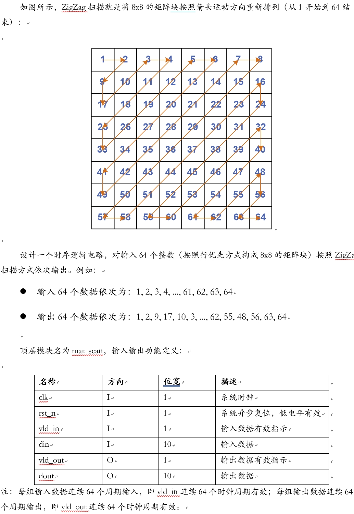
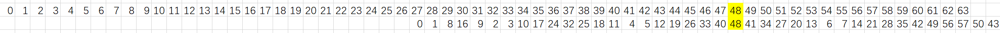
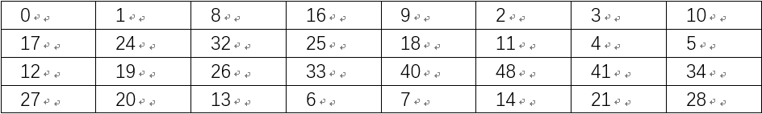
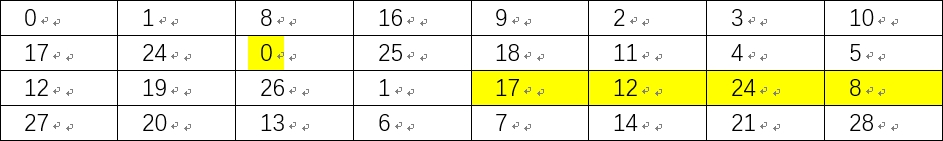
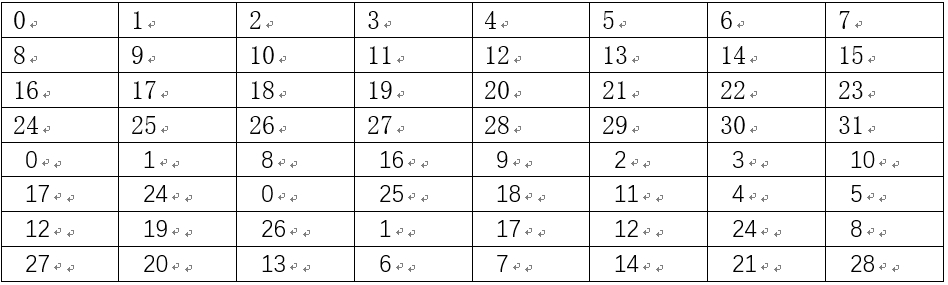
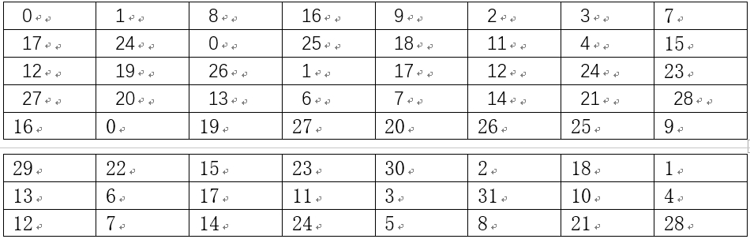
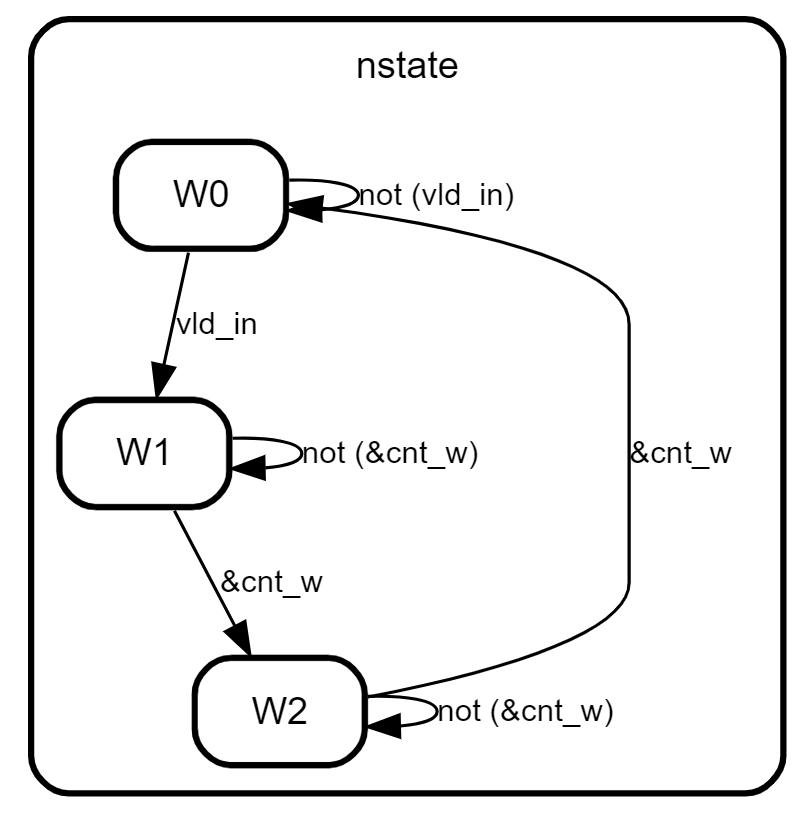
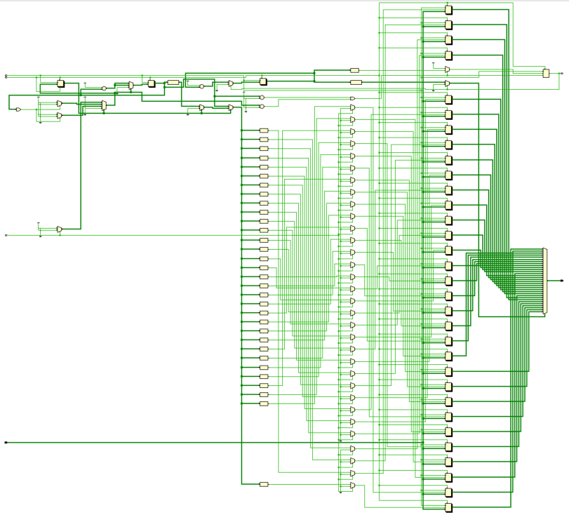
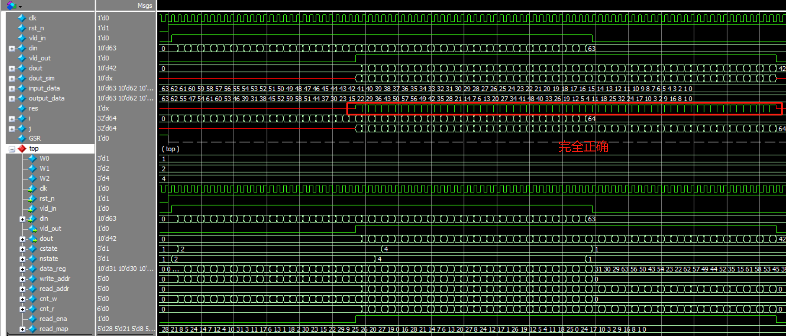

# 8×8矩阵的ZigZag扫描电路
## 1.设计功能与要求


## 2.算法原理
本设计本质上是输出重排，思路为使用寄存器组data_reg暂存输入数据，然后等到输入数据寄存完毕，按照编排好的顺序依次连续输出。

输入数据顺序为：

0	1	2	3	4	5	6	7	8	9	10	11	12	13	14	15	16	17	18	19	20	21	22	23	24	25	26	27	28	29	30	31	32	33	34	35	36	37	38	39	40	41	42	43	44	45	46	47	48	49	50	51	52	53	54	55	56	57	58	59	60	61	62	63

按照ZigZag扫描的输出数据顺序为：

0	1	8	16	9	2	3	10	17	24	32	25	18	11	4	5	12	19	26	33	40	48	41	34	27	20	13	6	7	14	21	28	35	42	49	56	57	50	43	36	29	22	15	23	30	37	44	51	58	59	52	45	38	31	39	46	53	60	61	54	47	55	62	63

### 2.1 未精减寄存器数量的设计
根据题目要求，重排后的序列也应当是连续64个数据输出，因此需要将输入和输出序列进行比较寻找某个时间恰好满足连续输出序列所需的数据不会发生缺失，以此来确定输出序列相对于输入序列的延迟，如下图所示，黄色高亮的48号数据恰好为输出序列不会发生数据确实的对齐位置。

由图中可以看出输出序列相对输入序列延迟27个时钟周期。

### 2.2 精减寄存器数量后的设计
寄存器数量未精减时，由于输入64个数据，因此需要64个寄存器。但是这种设计在寄存器数据被读出一次之后就不再被使用，这造成了资源的浪费，可以通过寄存器复用的方式来节省资源开销。

通过观察发现，上图中黄色高亮的48数据对齐之前已经输出了21个寄存器数值，因此至少可以复用21个寄存器。但是为了简单起见，本设计复用32个寄存器，节约了一半的寄存器数量。

#### 寄存器复用之后输入序列写地址变化：
由于仅采用32个寄存器，输入序列写地址的前32个仍然为顺序增加，后32个应改为复用前输出序列读地址的前32个，即：
0	1	2	3	4	5	6	7	8	9	10	11	12	13	14	15	16	17	18	19	20	21	22	23	24	25	26	27	28	29	30	31  0	1	8	16	9	2	3	10	17	24	32	25	18	11	4	5	12	19	26	33	40	48	41	34	27	20	13	6	7	14	21	28
由于仅有32个寄存器，因此地址大小超过31的需要映射到0-31范围内，映射方式与第一次映射相同，即已经输出完毕的寄存器。

修改前的输入序列写地址后32个：


修改后的输入序列写地址后32个：


其中黄色高亮的为映射改动的地址。因此可以得到写数据地址write_addr的顺序列表为：


#### 寄存器复用之后输出序列读地址变化：
输出序列读地址的前32个与输入序列写地址的后32个相同。

输出序列读地址的后32个同样采用将超过31的地址重新映射到0-31范围内的方式，可以得到读数据地址read_addr的顺序列表为：



综上所述，我们明确了ZigZag矩阵扫描的数据重排原理与步骤，下面将进行RTL实现。

## 3.RTL实现
根据第2小节中的描述和题目要求不难发现，需要维护寄存器写地址write_addr和读地址read_addr的控制逻辑。由于读地址相对写地址序列延迟28个时钟周期(27+1，保证对齐的黄色高亮48先写入再读出，避免RAW冲突)，因此read_addr仅存在不使能和使能两种情况，而write_addr存在不使能、使能与未读、使能与读同时进行三种情况。本设计采用简单的使能控制逻辑实现对read_addr的控制，采用三段式状态机实现对write_addr的控制，其状态转移图如下所示。



其中W0、W1、W2分别代表不使能、使能与未读、使能与读同时进行三种情况。

### 3.1 读地址映射表
本设计采用固定的映射表read_map来存放读地址。
```verilog
    wire [4:0] read_map [63:0];

    assign {read_map[0 ],read_map[1 ],read_map[2 ],read_map[3 ],read_map[4 ],read_map[5 ],read_map[6 ],read_map[7 ],
            read_map[8 ],read_map[9 ],read_map[10],read_map[11],read_map[12],read_map[13],read_map[14],read_map[15],
            read_map[16],read_map[17],read_map[18],read_map[19],read_map[20],read_map[21],read_map[22],read_map[23],
            read_map[24],read_map[25],read_map[26],read_map[27],read_map[28],read_map[29],read_map[30],read_map[31],
            read_map[32],read_map[33],read_map[34],read_map[35],read_map[36],read_map[37],read_map[38],read_map[39],
            read_map[40],read_map[41],read_map[42],read_map[43],read_map[44],read_map[45],read_map[46],read_map[47],
            read_map[48],read_map[49],read_map[50],read_map[51],read_map[52],read_map[53],read_map[54],read_map[55],
            read_map[56],read_map[57],read_map[58],read_map[59],read_map[60],read_map[61],read_map[62],read_map[63]
        }= {5'd0 ,5'd1 ,5'd8 ,5'd16,5'd9 ,5'd2 ,5'd3 ,5'd10,
            5'd17,5'd24,5'd0 ,5'd25,5'd18,5'd11,5'd4 ,5'd5 ,
            5'd12,5'd19,5'd26,5'd1 ,5'd17,5'd12,5'd24,5'd8,
            5'd27,5'd20,5'd13,5'd6 ,5'd7 ,5'd14,5'd21,5'd28,
            5'd16,5'd0 ,5'd19,5'd27,5'd20,5'd26,5'd25,5'd9,
            5'd29,5'd22,5'd15,5'd23,5'd30,5'd2 ,5'd18,5'd1 ,
            5'd13,5'd6 ,5'd17,5'd11,5'd3 ,5'd31,5'd10,5'd4 ,
            5'd12,5'd7 ,5'd14,5'd24,5'd5 ,5'd8 ,5'd21,5'd28};
```

### 3.2 读地址生成逻辑
使用读计数器cnt_r在读使能read_ena为高期间递增来索引得到读地址read_addr。
```verilog
    wire [4:0] read_addr;
    reg [5:0] cnt_r;
    reg read_ena;

    // read out data from data_reg
    always @(posedge clk or negedge rst_n) begin
        if(!rst_n)
            read_ena <= 1'b0;
        else if((cnt_w==5'd27)&&(nstate==W1))
            read_ena <= 1'b1;
        else if(cnt_r == 6'd63)
            read_ena <= 1'b0;
        else
            read_ena <= read_ena;
    end

    always @(posedge clk or negedge rst_n) begin
        if(!rst_n) begin
            cnt_r <= 6'd0;
        end
        else if(read_ena) begin
            cnt_r <= cnt_r + 6'd1;
        end
        else if(cnt_r == 6'd64) begin
            cnt_r <= 6'd0;
        end
        else begin
            cnt_r <= 6'd0;
        end
    end

    assign read_addr = read_ena?read_map[cnt_r]:5'd0;
```

### 3.3 写地址生成逻辑
写地址采用三段式状态机来控制，使用(&cnt_w)等效替代(cnt_w==5'd31)的判断逻辑，作为从状态W1跳转到状态W2、从状态W2跳转到状态W0的控制条件。在W1状态下，使用cnt_w作为write_addr；在W2状态下，使用cnt_w索引read_map作为write_addr。
```verilog
    // FSM state parameter
    localparam W0 = 3'b001;
    localparam W1 = 3'b010;
    localparam W2 = 3'b100;

    // signal define
    reg [2:0] cstate;
    reg [2:0] nstate;
    wire [4:0] write_addr;
    reg [4:0] cnt_w;

    // FSM1
    always @(posedge clk or negedge rst_n) begin
        if(!rst_n)
            cstate <= W0;
        else
            cstate <= nstate;
    end

    // FSM2
    always @(*) begin
        case (cstate)
            W0: begin
                if(vld_in)
                    nstate = W1;
                else
                    nstate = W0;
            end
            W1: begin
                if(&cnt_w)
                    nstate = W2;
                else
                    nstate = W1;
            end
            W2: begin
                if(&cnt_w)
                    nstate = W0;
                else
                    nstate = W2;
            end
            default: nstate = W0;
        endcase
    end

    // FSM3
    always @(posedge clk or negedge rst_n) begin
        if(!rst_n)begin
            cnt_w <= 5'd0;
        end
        else begin
            case (nstate)
                W1: begin
                    cnt_w <= cnt_w + 5'd1;
                end
                W2: begin
                    cnt_w <= cnt_w + 5'd1;
                end
                default: begin
                    cnt_w <= 5'd0;
                end
            endcase
        end
    end
    assign write_addr = (cstate==W1)?cnt_w:((cstate==W2)?read_map[cnt_w]:5'd0);
```

### 3.4 地址写入寄存器组和读出逻辑
使用data_reg寄存输入din，并使用3.3小节中的write_addr和3.2小节中的read_addr作为索引进行读写控制。
```verilog
    reg [9:0] data_reg [31:0];
    // writer data into data_reg
    always @(posedge clk or negedge rst_n) begin
        if(!rst_n)begin
            {data_reg[0 ],data_reg[1 ],data_reg[2 ],data_reg[3 ],data_reg[4 ],data_reg[5 ],data_reg[6 ],data_reg[7 ],
             data_reg[8 ],data_reg[9 ],data_reg[10],data_reg[11],data_reg[12],data_reg[13],data_reg[14],data_reg[15],
             data_reg[16],data_reg[17],data_reg[18],data_reg[19],data_reg[20],data_reg[21],data_reg[22],data_reg[23],
             data_reg[24],data_reg[25],data_reg[26],data_reg[27],data_reg[28],data_reg[29],data_reg[30],data_reg[31]} <= 320'd0;
        end
        else if(vld_in)begin
            data_reg[write_addr] <= din;
        end
        else begin
            {data_reg[0 ],data_reg[1 ],data_reg[2 ],data_reg[3 ],data_reg[4 ],data_reg[5 ],data_reg[6 ],data_reg[7 ],
             data_reg[8 ],data_reg[9 ],data_reg[10],data_reg[11],data_reg[12],data_reg[13],data_reg[14],data_reg[15],
             data_reg[16],data_reg[17],data_reg[18],data_reg[19],data_reg[20],data_reg[21],data_reg[22],data_reg[23],
             data_reg[24],data_reg[25],data_reg[26],data_reg[27],data_reg[28],data_reg[29],data_reg[30],data_reg[31]} <= 
             {data_reg[0 ],data_reg[1 ],data_reg[2 ],data_reg[3 ],data_reg[4 ],data_reg[5 ],data_reg[6 ],data_reg[7 ],
             data_reg[8 ],data_reg[9 ],data_reg[10],data_reg[11],data_reg[12],data_reg[13],data_reg[14],data_reg[15],
             data_reg[16],data_reg[17],data_reg[18],data_reg[19],data_reg[20],data_reg[21],data_reg[22],data_reg[23],
             data_reg[24],data_reg[25],data_reg[26],data_reg[27],data_reg[28],data_reg[29],data_reg[30],data_reg[31]};
        end
    end

    assign vld_out = read_ena;
    assign dout = data_reg[read_addr];
```

### 3.5 完整代码
完整代码如下。
```verilog
module mat_scan(
    input clk,
    input rst_n,
    input vld_in,
    input [9:0] din,
    output vld_out,
    output [9:0] dout
    );
    // FSM state parameter
    localparam W0 = 3'b001;
    localparam W1 = 3'b010;
    localparam W2 = 3'b100;

    // signal define
    reg [2:0] cstate;
    reg [2:0] nstate;
    reg [9:0] data_reg [31:0];
    wire [4:0] write_addr, read_addr;
    reg [4:0] cnt_w;
    reg [5:0] cnt_r;
    reg read_ena;
    wire [4:0] read_map [63:0];

    // FSM1
    always @(posedge clk or negedge rst_n) begin
        if(!rst_n)
            cstate <= W0;
        else
            cstate <= nstate;
    end

    // FSM2
    always @(*) begin
        case (cstate)
            W0: begin
                if(vld_in)
                    nstate = W1;
                else
                    nstate = W0;
            end
            W1: begin
                if(&cnt_w)
                    nstate = W2;
                else
                    nstate = W1;
            end
            W2: begin
                if(&cnt_w)
                    nstate = W0;
                else
                    nstate = W2;
            end
            default: nstate = W0;
        endcase
    end

    // FSM3
    always @(posedge clk or negedge rst_n) begin
        if(!rst_n)begin
            cnt_w <= 5'd0;
        end
        else begin
            case (nstate)
                W1: begin
                    cnt_w <= cnt_w + 5'd1;
                end
                W2: begin
                    cnt_w <= cnt_w + 5'd1;
                end
                default: begin
                    cnt_w <= 5'd0;
                end
            endcase
        end
    end
    assign write_addr = (cstate==W1)?cnt_w:((cstate==W2)?read_map[cnt_w]:5'd0);

    // map 1-63 address to zigzag address
    assign {read_map[0 ],read_map[1 ],read_map[2 ],read_map[3 ],read_map[4 ],read_map[5 ],read_map[6 ],read_map[7 ],
            read_map[8 ],read_map[9 ],read_map[10],read_map[11],read_map[12],read_map[13],read_map[14],read_map[15],
            read_map[16],read_map[17],read_map[18],read_map[19],read_map[20],read_map[21],read_map[22],read_map[23],
            read_map[24],read_map[25],read_map[26],read_map[27],read_map[28],read_map[29],read_map[30],read_map[31],
            read_map[32],read_map[33],read_map[34],read_map[35],read_map[36],read_map[37],read_map[38],read_map[39],
            read_map[40],read_map[41],read_map[42],read_map[43],read_map[44],read_map[45],read_map[46],read_map[47],
            read_map[48],read_map[49],read_map[50],read_map[51],read_map[52],read_map[53],read_map[54],read_map[55],
            read_map[56],read_map[57],read_map[58],read_map[59],read_map[60],read_map[61],read_map[62],read_map[63]
        }= {5'd0 ,5'd1 ,5'd8 ,5'd16,5'd9 ,5'd2 ,5'd3 ,5'd10,
            5'd17,5'd24,5'd0 ,5'd25,5'd18,5'd11,5'd4 ,5'd5 ,
            5'd12,5'd19,5'd26,5'd1 ,5'd17,5'd12,5'd24,5'd8,
            5'd27,5'd20,5'd13,5'd6 ,5'd7 ,5'd14,5'd21,5'd28,
            5'd16,5'd0 ,5'd19,5'd27,5'd20,5'd26,5'd25,5'd9,
            5'd29,5'd22,5'd15,5'd23,5'd30,5'd2 ,5'd18,5'd1 ,
            5'd13,5'd6 ,5'd17,5'd11,5'd3 ,5'd31,5'd10,5'd4 ,
            5'd12,5'd7 ,5'd14,5'd24,5'd5 ,5'd8 ,5'd21,5'd28};

    // writer data into data_reg
    always @(posedge clk or negedge rst_n) begin
        if(!rst_n)begin
            {data_reg[0 ],data_reg[1 ],data_reg[2 ],data_reg[3 ],data_reg[4 ],data_reg[5 ],data_reg[6 ],data_reg[7 ],
             data_reg[8 ],data_reg[9 ],data_reg[10],data_reg[11],data_reg[12],data_reg[13],data_reg[14],data_reg[15],
             data_reg[16],data_reg[17],data_reg[18],data_reg[19],data_reg[20],data_reg[21],data_reg[22],data_reg[23],
             data_reg[24],data_reg[25],data_reg[26],data_reg[27],data_reg[28],data_reg[29],data_reg[30],data_reg[31]} <= 320'd0;
        end
        else if(vld_in)begin
            data_reg[write_addr] <= din;
        end
        else begin
            {data_reg[0 ],data_reg[1 ],data_reg[2 ],data_reg[3 ],data_reg[4 ],data_reg[5 ],data_reg[6 ],data_reg[7 ],
             data_reg[8 ],data_reg[9 ],data_reg[10],data_reg[11],data_reg[12],data_reg[13],data_reg[14],data_reg[15],
             data_reg[16],data_reg[17],data_reg[18],data_reg[19],data_reg[20],data_reg[21],data_reg[22],data_reg[23],
             data_reg[24],data_reg[25],data_reg[26],data_reg[27],data_reg[28],data_reg[29],data_reg[30],data_reg[31]} <= 
             {data_reg[0 ],data_reg[1 ],data_reg[2 ],data_reg[3 ],data_reg[4 ],data_reg[5 ],data_reg[6 ],data_reg[7 ],
             data_reg[8 ],data_reg[9 ],data_reg[10],data_reg[11],data_reg[12],data_reg[13],data_reg[14],data_reg[15],
             data_reg[16],data_reg[17],data_reg[18],data_reg[19],data_reg[20],data_reg[21],data_reg[22],data_reg[23],
             data_reg[24],data_reg[25],data_reg[26],data_reg[27],data_reg[28],data_reg[29],data_reg[30],data_reg[31]};
        end
    end

    // read out data from data_reg
    always @(posedge clk or negedge rst_n) begin
        if(!rst_n)
            read_ena <= 1'b0;
        else if((cnt_w==5'd27)&&(nstate==W1))
            read_ena <= 1'b1;
        else if(cnt_r == 6'd63)
            read_ena <= 1'b0;
        else
            read_ena <= read_ena;
    end

    always @(posedge clk or negedge rst_n) begin
        if(!rst_n) begin
            cnt_r <= 6'd0;
        end
        else if(read_ena) begin
            cnt_r <= cnt_r + 6'd1;
        end
        else if(cnt_r == 6'd64) begin
            cnt_r <= 6'd0;
        end
        else begin
            cnt_r <= 6'd0;
        end
    end
    assign read_addr = read_ena?read_map[cnt_r]:5'd0;
    assign vld_out = read_ena;
    assign dout = data_reg[read_addr];

endmodule
```

Vivado RTL analysis结果如下图所示，符合设计预期。


## 4.RTL仿真结果
输入数据din为0-63递增，即
```verilog
assign {input_data[0 ],input_data[1 ],input_data[2 ],input_data[3 ],input_data[4 ],input_data[5 ],input_data[6 ],input_data[7 ],
input_data[8 ],input_data[9 ],input_data[10],input_data[11],input_data[12],input_data[13],input_data[14],input_data[15],
input_data[16],input_data[17],input_data[18],input_data[19],input_data[20],input_data[21],input_data[22],input_data[23],
input_data[24],input_data[25],input_data[26],input_data[27],input_data[28],input_data[29],input_data[30],input_data[31],
input_data[32],input_data[33],input_data[34],input_data[35],input_data[36],input_data[37],input_data[38],input_data[39],
input_data[40],input_data[41],input_data[42],input_data[43],input_data[44],input_data[45],input_data[46],input_data[47],
input_data[48],input_data[49],input_data[50],input_data[51],input_data[52],input_data[53],input_data[54],input_data[55],
input_data[56],input_data[57],input_data[58],input_data[59],input_data[60],input_data[61],input_data[62],input_data[63]
        }= {10'd0 ,10'd1 ,10'd2 ,10'd3 ,10'd4 ,10'd5 ,10'd6 ,10'd7 ,
            10'd8 ,10'd9 ,10'd10,10'd11,10'd12,10'd13,10'd14,10'd15,
            10'd16,10'd17,10'd18,10'd19,10'd20,10'd21,10'd22,10'd23,
            10'd24,10'd25,10'd26,10'd27,10'd28,10'd29,10'd30,10'd31,
            10'd32,10'd33,10'd34,10'd35,10'd36,10'd37,10'd38,10'd39,
            10'd40,10'd41,10'd42,10'd43,10'd44,10'd45,10'd46,10'd47,
            10'd48,10'd49,10'd50,10'd51,10'd52,10'd53,10'd54,10'd55,
            10'd56,10'd57,10'd58,10'd59,10'd60,10'd61,10'd62,10'd63};
```
在testbench中列出期望输出数据顺序为：
```verilog
assign {output_data[0 ],output_data[1 ],output_data[2 ],output_data[3 ],output_data[4 ],output_data[5 ],output_data[6 ],output_data[7 ],
output_data[8 ],output_data[9 ],output_data[10],output_data[11],output_data[12],output_data[13],output_data[14],output_data[15],
output_data[16],output_data[17],output_data[18],output_data[19],output_data[20],output_data[21],output_data[22],output_data[23],
output_data[24],output_data[25],output_data[26],output_data[27],output_data[28],output_data[29],output_data[30],output_data[31],
output_data[32],output_data[33],output_data[34],output_data[35],output_data[36],output_data[37],output_data[38],output_data[39],
output_data[40],output_data[41],output_data[42],output_data[43],output_data[44],output_data[45],output_data[46],output_data[47],
output_data[48],output_data[49],output_data[50],output_data[51],output_data[52],output_data[53],output_data[54],output_data[55],
output_data[56],output_data[57],output_data[58],output_data[59],output_data[60],output_data[61],output_data[62],output_data[63]
        }= {10'd0 ,10'd1 ,10'd8 ,10'd16,10'd9 ,10'd2 ,10'd3 ,10'd10,
            10'd17,10'd24,10'd32,10'd25,10'd18,10'd11,10'd4 ,10'd5 ,
            10'd12,10'd19,10'd26,10'd33,10'd40,10'd48,10'd41,10'd34,
            10'd27,10'd20,10'd13,10'd6 ,10'd7 ,10'd14,10'd21,10'd28,
            10'd35,10'd42,10'd49,10'd56,10'd57,10'd50,10'd43,10'd36,
            10'd29,10'd22,10'd15,10'd23,10'd30,10'd37,10'd44,10'd51,
            10'd58,10'd59,10'd52,10'd45,10'd38,10'd31,10'd39,10'd46,
            10'd53,10'd60,10'd61,10'd54,10'd47,10'd55,10'd62,10'd63};
```
通过信号res比较mat_scan单元输出dout和预期输出dout_sim，得到仿真波形如下：

从波形可以看出本设计功能正确。

# 写在最后
2025年1月上旬总算结束了研一上学期繁忙的课程，总算有时间整理总结UCAS《高等数字集成电路分析与设计》课程中老师所布置的作业题，作为老师上课来不及仔细讲解内容的补充，也作为以后自己复习的参考。笔者作为初学者难免出现错误，请读者多多批评指正，也希望看到本博客的学弟学妹多多思考、不要盲目抄袭。

# 源码
verilog源码开源在：[lionelZhaowy/Digital-IC-Analysis-and-Design](https://github.com/lionelZhaowy/Digital-IC-Analysis-and-Design.git "lionelZhaowy/Digital-IC-Analysis-and-Design")

**作者：LionelZhao 欢迎转载，主动输出、与人分享是进步的源泉！！！**

**转载请保留原文地址：[lionelZhaowy/Digital-IC-Analysis-and-Design](https://github.com/lionelZhaowy/Digital-IC-Analysis-and-Design.git "lionelZhaowy/Digital-IC-Analysis-and-Design")**

**创作不易，如果觉得本文对您有帮助欢迎读者客官多多打赏！！！**


工程文件请在海鲜市场购买。
