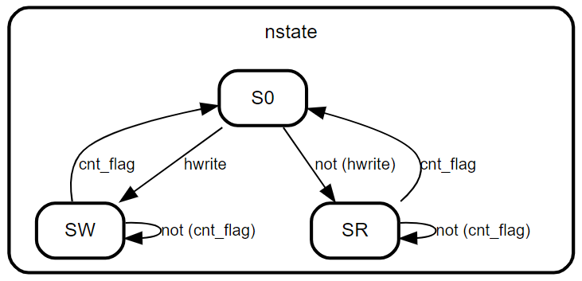

# 基于AHB协议的SRAM读写控制器
## 1.设计功能与要求


## 2.算法原理
本设计采用 **三段式状态机** 实现了一个AHB Slave，将其与Vivado中Block Memory Generator生成的SRAM单元相连，实现接受AHB控制信号完成对RAM单元的读写操作。由于地址空间大小为$(3FFC)_{16}=(16380)_{10}$、SRAM深度为4096，因此地址映射为16380/4096≈4，所以需要对haddr>>2才能得到对应的SRAM地址。由AMBA总线传输协议得进行一次数据传输的时候首先需要在地址相位发送地址和控制信号，然后在下一个周期数据相位时发送或接受该地址对应的数据信号，其时序如下：


题目要求实现突发模式传输，在此模式下可以流水进行连续4/8/16个数据的读写操作，其时序如下：


本设计采用三段式状态机实现，在S0状态下进行地址相位，通过hwrite信号判断进入SW写数据相位还是SR读数据相位，在SW/SR状态下通过hburst、htrans信号控制计数器cnt来实现单数据传输模式和突发传输模式，然后cnt计数满之后再次进入S0状态，其状态转移图如下：


## 3.RTL实现
### 3.1 AHB从机模块
根据第2小节中的描述和参考文档《最经典的AMBA总线中文资料》中的描述，很容易采用状态机实现AHB从机Verilog代码如下。
```verilog
module sram_ctr_ahb(
    input hclk,
    input hresetn,
    input hwrite,
    input [1:0] htrans,
    input [2:0] hsize,
    input [31:0] haddr,
    input [2:0] hburst,
    input [31:0] hwdata,
    output reg hready,
    output reg [1:0] hresp,
    output [31:0] hrdata,
    output reg sram_scn, //低有效
    output reg sram_wen, //低有效
    output [11:0] sram_a,
    output [31:0] sram_d,
    input [31:0] sram_q
    );
    // parameter define
    // hsize == 3'b000;//8bit
    // hsize == 3'b001;//16bit
    // hsize == 3'b010;//32bit
    // hsize == 3'b011;//64bit
    // hsize == 3'b100;//128bit
    // hsize == 3'b101;//256bit
    // hsize == 3'b110;//512bit
    // hsize == 3'b111;//1024bit
    // htrans
    localparam IDLE  = 2'b00;
    localparam BUSY  = 2'b01;
    localparam NONSEQ = 2'b10;
    localparam SEQ = 2'b11;
    // hburst
    localparam SINGLE = 3'b000;//单一传输
    localparam INCR   = 3'b001;//未指定长度的增量突发
    localparam WRAP4  = 3'b010;//4拍回环突发
    localparam INCR4  = 3'b011;//4拍增量突发
    localparam WRAP8  = 3'b100;//8拍回环突发
    localparam INCR8  = 3'b101;//8拍增量突发
    localparam WRAP16 = 3'b110;//16拍回环突发
    localparam INCR16 = 3'b111;//16拍增量突发
    // hresp
    localparam OKAY  = 2'b00;
    localparam ERROR = 2'b01;
    localparam RETRY = 2'b10;
    localparam SPLIT = 2'b11;
    // FSM state
    localparam S0 = 3'b001;//地址相位
    localparam SW = 3'b010;//数据相位-写
    localparam SR = 3'b100;//数据相位-读

    // signal define
    reg [2:0] cstate, nstate, cstate_r;
    reg cnt_flag;
    reg [3:0] cnt;
    reg [2:0] hsize_r;
    reg [31:0] haddr_r;
    reg [2:0] hburst_r;

    // define cnt max by hburst
    always @(*) begin
        case (hburst)
            SINGLE: cnt_flag = (cnt==4'd0)?1'b1:1'b0;
            INCR  : cnt_flag = (cnt==4'd0)?1'b1:1'b0;
            WRAP4 : cnt_flag = (cnt==4'd3)?1'b1:1'b0;
            INCR4 : cnt_flag = (cnt==4'd3)?1'b1:1'b0;
            WRAP8 : cnt_flag = (cnt==4'd7)?1'b1:1'b0;
            INCR8 : cnt_flag = (cnt==4'd7)?1'b1:1'b0;
            WRAP16: cnt_flag = (cnt==4'd15)?1'b1:1'b0;
            INCR16: cnt_flag = (cnt==4'd15)?1'b1:1'b0;
            default:cnt_flag = (cnt==4'd0)?1'b1:1'b0;
        endcase
    end

    // FSM1
    always @(posedge hclk or negedge hresetn) begin
        if(!hresetn)begin
            cstate <= S0;
            cstate_r <= S0;
            hsize_r <= 3'd0;
            haddr_r <= 32'd0;
            hburst_r <= 3'd0;
        end
        else begin
            cstate <= nstate;
            cstate_r <= cstate;
            hsize_r <= hsize;
            haddr_r <= haddr;
            hburst_r <= hburst;
        end
    end

    // FSM2
    always @(*) begin
        case (cstate)
            S0: begin
                if(hwrite) begin
                    nstate = SW;
                end
                else begin
                    nstate = SR;
                end
            end
            SW: begin
                if(cnt_flag) begin
                    nstate = S0;
                end
                else begin
                    nstate = SW;
                end
            end 
            SR: begin
                if(cnt_flag) begin
                    nstate = S0;
                end
                else begin
                    nstate = SR;
                end
            end 
            default: nstate = S0;
        endcase
    end

    // FSM3
    always @(posedge hclk or negedge hresetn) begin
        if(!hresetn)begin
            hready <= 1'b0;
            hresp <= RETRY;
            sram_scn <= 1'b1;
            sram_wen <= 1'b0;
        end
        else begin
            hready <= 1'b1;
            hresp <= OKAY;

            case (nstate)
                S0: begin
                    // SRAM控制
                    sram_scn <= 1'b1;
                    sram_wen <= 1'b0;
                end
                SW: begin
                    // SRAM控制
                    sram_scn <= 1'b0;
                    sram_wen <= 1'b0;
                end
                SR: begin
                    // SRAM控制
                    sram_scn <= 1'b0;
                    sram_wen <= 1'b1;
                end
                default: begin
                    // SRAM控制
                    sram_scn <= 1'b1;
                    sram_wen <= 1'b0;
                end
            endcase
        end
    end

    always @(posedge hclk or negedge hresetn) begin
        if(!hresetn)begin
            cnt <= 4'd0;
        end
        else begin
            case (cstate)
                S0: begin
                    cnt <= 4'd0;
                end
                SW: begin
                    if(htrans==BUSY) begin
                        cnt <= cnt;
                    end
                    else begin
                        cnt <= cnt + 4'd1;
                    end
                end
                SR: begin
                    if(htrans==BUSY) begin
                        cnt <= cnt;
                    end
                    else begin
                        cnt <= cnt + 4'd1;
                    end
                end
                default: begin
                    cnt <= 4'd0;
                end
            endcase
        end
    end

    assign hrdata = (cstate_r==SR)?sram_q:32'd0;
    assign sram_d = (cstate==SW)?hwdata:32'd0;
    assign sram_a = ((cstate==SW)||(cstate==SR))?haddr_r[13:2]:12'd0;

endmodule
```

### 3.2 顶层模块
在顶层中例化AHB从机和Vivado的SRAM IP，可得Verilog代码如下。
```verilog
module AHB_SRAM_top(
    input hclk,
    input hresetn,
    input hwrite,
    input [1:0] htrans,
    input [2:0] hsize,
    input [31:0] haddr, // 0x00000000 – 0x00003FFC
    input [2:0] hburst,
    input [31:0] hwdata,
    output hready,
    output [1:0] hresp,
    output [31:0] hrdata
    );
    // signal define
    wire sram_scn, sram_wen;
    wire [11:0] sram_a;
    wire [31:0] sram_d;
    wire [31:0] sram_q;

    // module instance
    sram_ctr_ahb  sram_ctr_ahb_inst (
        .hclk(hclk),
        .hresetn(hresetn),
        .hwrite(hwrite),
        .htrans(htrans),
        .hsize(hsize),
        .haddr(haddr),
        .hburst(hburst),
        .hwdata(hwdata),
        .hready(hready),
        .hresp(hresp),
        .hrdata(hrdata),
        .sram_scn(sram_scn),
        .sram_wen(sram_wen),
        .sram_a(sram_a),
        .sram_d(sram_d),
        .sram_q(sram_q)
    );
    
    SRAM_4096_32 SRAM (
        .clka(hclk),    // input wire clka
        .ena(!sram_scn),// input wire ena
        .wea(!sram_wen),// input wire [0 : 0] wea
        .addra(sram_a), // input wire [11 : 0] addra
        .dina(sram_d),  // input wire [31 : 0] dina
        .douta(sram_q)  // output wire [31 : 0] douta
    );

endmodule
```

Vivado RTL analysis结果如下图所示，在顶层AHB_SRAM_top中例化本设计sram_ctr_ahb和vivado的BRAM IP核SRAM,符合设计预期。

AHB总线从机sram_ctr_ahb采用三段式状态机实现，其vivado原理图如下：


## 4.RTL仿真结果
### 测试用例1：16拍增量突发写SRAM
在地址相位输入hwrite=1、hburst=INCR16、htrans=SEQ、haddr=32’h00000010，然后在后续15个连续时钟周期每个时钟周期haddr的地址+16’d4，并使用hwdata=$random随机生成测试激励，可得仿真波形如下：


通过modelsim的Memory List观察得到SRAM中数据如下:

由于地址对齐因此0x00000010对应到SRAM地址为0x00000004，可见数据被成功写入SRAM。

### 测试用例2：8拍增量突发读SRAM
在地址相位输入hwrite=0、hburst=INCR8、htrans=SEQ、haddr=32’h00000010，然后在后续7个连续时钟周期每个时钟周期haddr的地址+16’d4，可得仿真波形如下：


由于SRAM输出会延迟一个周期，可见仿真波形正确。

# 参考与致谢
#### 《最经典的AMBA总线中文资料》


# 写在最后
2025年1月上旬总算结束了研一上学期繁忙的课程，总算有时间整理总结UCAS《高等数字集成电路分析与设计》课程中老师所布置的作业题，作为老师上课来不及仔细讲解内容的补充，也作为以后自己复习的参考。笔者作为初学者难免出现错误，请读者多多批评指正，也希望看到本博客的学弟学妹多多思考、不要盲目抄袭。

# 源码
verilog源码开源在：[lionelZhaowy/Digital-IC-Analysis-and-Design](https://github.com/lionelZhaowy/Digital-IC-Analysis-and-Design.git "lionelZhaowy/Digital-IC-Analysis-and-Design")

**作者：LionelZhao 欢迎转载，主动输出、与人分享是进步的源泉！！！**

**转载请保留原文地址：[lionelZhaowy/Digital-IC-Analysis-and-Design](https://github.com/lionelZhaowy/Digital-IC-Analysis-and-Design.git "lionelZhaowy/Digital-IC-Analysis-and-Design")**

**创作不易，如果觉得本文对您有帮助欢迎读者客官多多打赏！！！**


工程文件请在海鲜市场购买。
