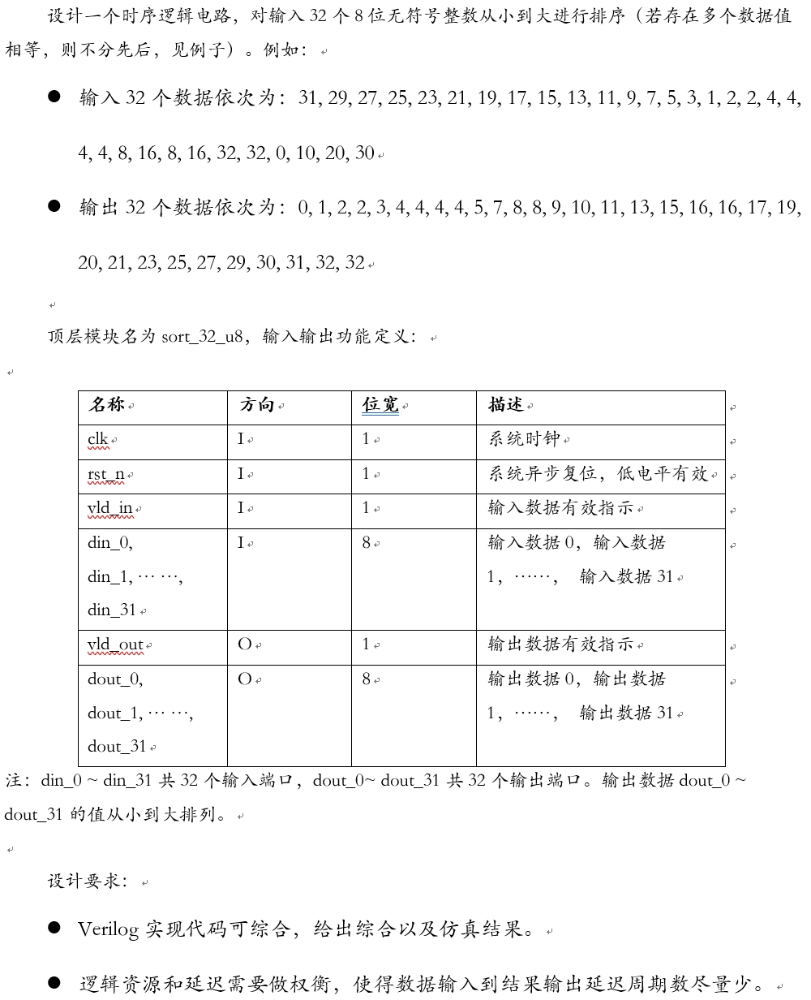
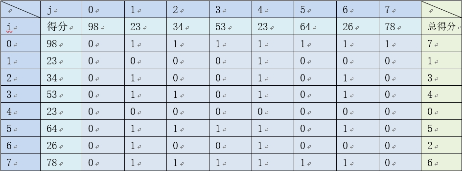
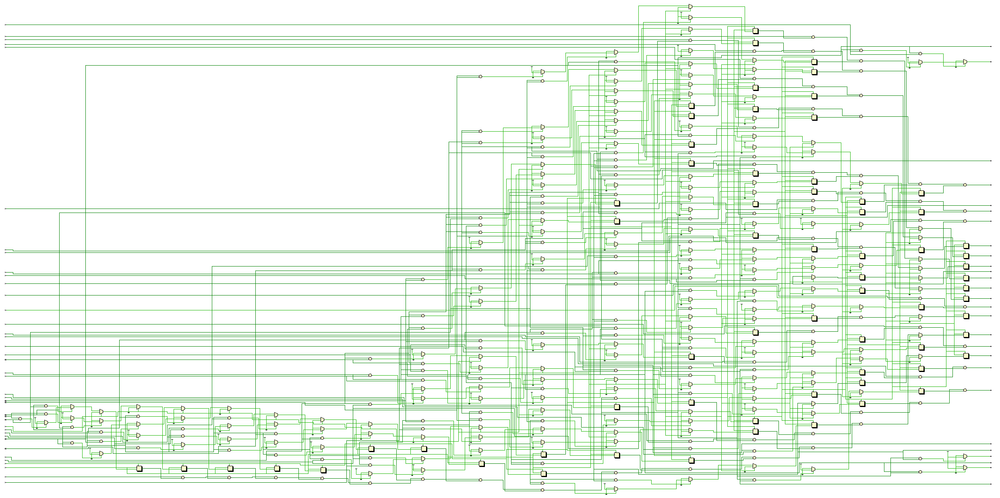
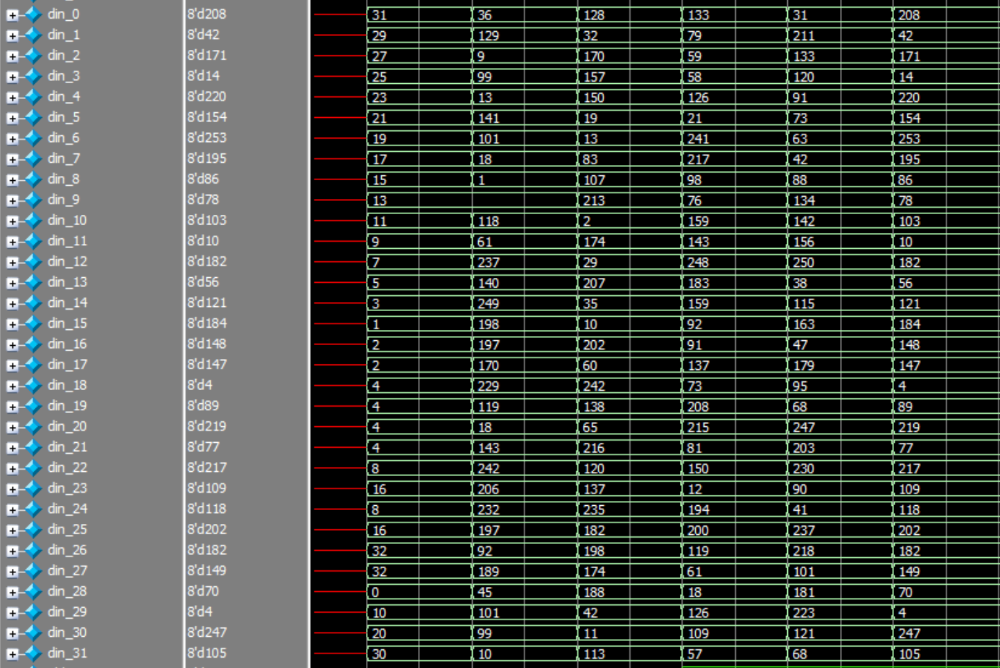
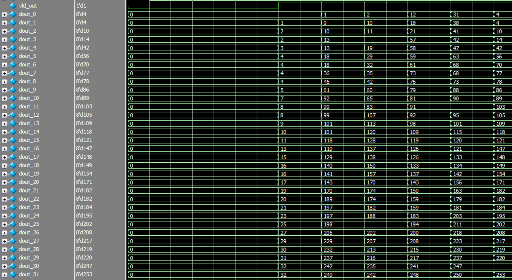

# 基于全并行排序的32个8位无符号数的排序逻辑
## 1.设计功能与要求


## 2.算法原理
本设计采用 **全并行排序** 算法，其基本思想是将输入序列中一个数据与其他所有数据进行比较并统计得分，得分累积越高代表该数据的数值越大。
### 得分规则
输入序列中的一个数据A与其他所有数据进行比较，在某一次与数据B的比较中，当：
- 数据A > 数据B，则数据A得1分
- 数据A < 数据B，则数据A得0分
- 数据A == 数据B
  - 若数据A的索引小于数据B，则数据A得1分
  - 若数据A的索引大于数据B，则数据A得0分

以8个数据序列{98, 23, 34, 53, 23, 64, 26, 78}的排序为例，根据上述得分规则可以得到列表如下，其中每行为要与其他数值比较的数值，每列代表被比较的数值：


全并行排序算法的第一步为将所有数据与其他数据进行比较并得到得分列表，第二步将所有得分累积获得总得分，第三步以总得分为索引得到输出序列。

综上所述，我们明确了全并行排序算法的原理与步骤，下面将进行RTL实现。

## 3.RTL实现
根据第2小节中的描述，将全并行排序电路逻辑也分为统计比较得分、得分累加、输出排序三个流水阶段。
### 3.1 第一阶段：统计比较得分
根据题目要求，输入32个8位无符号数是从32个8位输入端口输入的，但是为了方便在generate块中使用for循环，使用din来存放din_31到din_0。
```verilog
    wire [7:0] din [31:0]; // 存放输入数据
    // input data assign
    assign {din[31],din[30],din[29],din[28],din[27],din[26],din[25],din[24],
            din[23],din[22],din[21],din[20],din[19],din[18],din[17],din[16],
            din[15],din[14],din[13],din[12],din[11],din[10],din[9],din[8],
            din[7],din[6],din[5],din[4],din[3],din[2],din[1],din[0]
        } = {din_31,din_30,din_29,din_28,din_27,din_26,din_25,din_24,
            din_23,din_22,din_21,din_20,din_19,din_18,din_17,din_16,
            din_15,din_14,din_13,din_12,din_11,din_10,din_9,din_8,
            din_7,din_6,din_5,din_4,din_3,din_2,din_1,din_0};
```
在第一级中使用din_pipe1寄存din信号用于第二级的再次寄存从而保证第三级输出重排。使用flag_pipe1用于存放比较之后的得分，用于第二级得分累加。使用valid_pipe1、valid_sum1_pipe1和valid_sum_pipe1的组合来判断第一级是否比较完毕。
```verilog
    reg [7:0] din_pipe1 [31:0]; // 寄存输入数据
    reg [5:0] flag_pipe1 [31:0][31:0]; // 2D表格，统计比较分值
    reg valid_pipe1 [31:0][31:0]; // 和后续valid_sum1_pipe1、valid_sum_pipe1判断第一阶段是否完成
    wire valid_sum1_pipe1 [31:0];
    wire valid_sum_pipe1;
    genvar i,j;

    // compare parallel
    generate
        for (j = 0; j<32; j=j+1) begin
            assign valid_sum1_pipe1[j] = &{valid_pipe1[j][0],valid_pipe1[j][1],valid_pipe1[j][2],valid_pipe1[j][3],valid_pipe1[j][4],valid_pipe1[j][5],valid_pipe1[j][6],valid_pipe1[j][7],
                                           valid_pipe1[j][8],valid_pipe1[j][9],valid_pipe1[j][10],valid_pipe1[j][11],valid_pipe1[j][12],valid_pipe1[j][13],valid_pipe1[j][14],valid_pipe1[j][15],
                                           valid_pipe1[j][16],valid_pipe1[j][17],valid_pipe1[j][18],valid_pipe1[j][19],valid_pipe1[j][20],valid_pipe1[j][21],valid_pipe1[j][22],valid_pipe1[j][23],
                                           valid_pipe1[j][24],valid_pipe1[j][25],valid_pipe1[j][26],valid_pipe1[j][27],valid_pipe1[j][28],valid_pipe1[j][29],valid_pipe1[j][30],valid_pipe1[j][31]};
        end
    endgenerate

    assign valid_sum_pipe1 = &{valid_sum1_pipe1[0],valid_sum1_pipe1[1],valid_sum1_pipe1[2],valid_sum1_pipe1[3],valid_sum1_pipe1[4],valid_sum1_pipe1[5],valid_sum1_pipe1[6],valid_sum1_pipe1[7],
                               valid_sum1_pipe1[8],valid_sum1_pipe1[9],valid_sum1_pipe1[10],valid_sum1_pipe1[11],valid_sum1_pipe1[12],valid_sum1_pipe1[13],valid_sum1_pipe1[14],valid_sum1_pipe1[15],
                               valid_sum1_pipe1[16],valid_sum1_pipe1[17],valid_sum1_pipe1[18],valid_sum1_pipe1[19],valid_sum1_pipe1[20],valid_sum1_pipe1[21],valid_sum1_pipe1[22],valid_sum1_pipe1[23],
                               valid_sum1_pipe1[24],valid_sum1_pipe1[25],valid_sum1_pipe1[26],valid_sum1_pipe1[27],valid_sum1_pipe1[28],valid_sum1_pipe1[29],valid_sum1_pipe1[30],valid_sum1_pipe1[31]};

    generate
        for (j = 0; j<32; j=j+1) begin:loop_j
            for(i = 0; i<32; i=i+1) begin:loop_i
                always@(posedge	clk or negedge rst_n) begin
                    if(!rst_n) begin
                        valid_pipe1[j][i] <= 0;
                        flag_pipe1[j][i]  <= 0;	
                    end
                    else if(vld_in) begin
                        if(din[j] < din[i]) begin
                            flag_pipe1[j][i] <= 0;
                        end
                        else if(din[j] == din[i]) begin
                            if(j >= i) begin
                                flag_pipe1[j][i] <= 0;
                            end
                            else begin
                                flag_pipe1[j][i] <= 1;
                            end
                        end
                        else begin
                            flag_pipe1[j][i] <= 1;
                        end
                        valid_pipe1[j][i] <= vld_in;
                    end
                    else begin
                        flag_pipe1[j][i] <= 0;
                        valid_pipe1[j][i] <= 0;
                    end
                end
            end

            always @(posedge clk or negedge rst_n) begin
                if (!rst_n) begin
                    din_pipe1[j] <= 0;
                end
                else if (vld_in) begin
                    din_pipe1[j] <= din[j];
                end
                else begin
                    din_pipe1[j] <= 0;
                end
            end
        end
    endgenerate
```

### 3.2 第二阶段：得分累加
使用flag_sum_pipe2累积第一级得到的flag_pipe1，从而得到每一个输入数据的得分之和。使用valid_pipe2和valid_sum_pipe2的组合来判断第二级是否完成。
```verilog
    reg [4:0] flag_sum_pipe2  [31:0]; // 累积得分和
    reg valid_pipe2 [31:0]; // 和后续valid_sum_pipe2判断第二阶段是否完成
    wire valid_sum_pipe2;
    assign valid_sum_pipe2 = &{&valid_pipe2[0 ],&valid_pipe2[1 ],&valid_pipe2[2 ],&valid_pipe2[3 ],&valid_pipe2[4 ],&valid_pipe2[5 ],&valid_pipe2[6 ],&valid_pipe2[7 ],
                               &valid_pipe2[8 ],&valid_pipe2[9 ],&valid_pipe2[10],&valid_pipe2[11],&valid_pipe2[12],&valid_pipe2[13],&valid_pipe2[14],&valid_pipe2[15],
                               &valid_pipe2[16],&valid_pipe2[17],&valid_pipe2[18],&valid_pipe2[19],&valid_pipe2[20],&valid_pipe2[21],&valid_pipe2[22],&valid_pipe2[23],
                               &valid_pipe2[24],&valid_pipe2[25],&valid_pipe2[26],&valid_pipe2[27],&valid_pipe2[28],&valid_pipe2[29],&valid_pipe2[30],&valid_pipe2[31]} == 1'b1;
    
    generate
        for (j = 0; j<32; j=j+1) begin
            always @(posedge clk or negedge rst_n) begin
                if (!rst_n) begin
                    valid_pipe2[j] <= 0;
                    flag_sum_pipe2[j] <= 0;
                    din_pipe2[j] <= 0;
                end
                else if (valid_sum_pipe1) begin
                    valid_pipe2[j] <= valid_sum_pipe1;
                    flag_sum_pipe2[j] <= flag_pipe1[j][0 ] + flag_pipe1[j][1 ] + flag_pipe1[j][2 ] + flag_pipe1[j][3 ] + flag_pipe1[j][4 ] + flag_pipe1[j][5 ] + flag_pipe1[j][6 ] + flag_pipe1[j][7 ] + 
                                         flag_pipe1[j][8 ] + flag_pipe1[j][9 ] + flag_pipe1[j][10] + flag_pipe1[j][11] + flag_pipe1[j][12] + flag_pipe1[j][13] + flag_pipe1[j][14] + flag_pipe1[j][15] + 
                                         flag_pipe1[j][16] + flag_pipe1[j][17] + flag_pipe1[j][18] + flag_pipe1[j][19] + flag_pipe1[j][20] + flag_pipe1[j][21] + flag_pipe1[j][22] + flag_pipe1[j][23] + 
                                         flag_pipe1[j][24] + flag_pipe1[j][25] + flag_pipe1[j][26] + flag_pipe1[j][27] + flag_pipe1[j][28] + flag_pipe1[j][29] + flag_pipe1[j][30] + flag_pipe1[j][31] ;
                    din_pipe2[j] <= din_pipe1[j];
                end 
                else begin
                    valid_pipe2[j] <= 0;
                    flag_sum_pipe2[j] <= 0;
                    din_pipe2[j] <= 0;
                end
            end
        end
    endgenerate
```

### 3.3 第三阶段：输出排序
使用din_pipe3存放使用flag_sum_pipe2进行索引重排后的输出数据。
```verilog
    reg [7:0] din_pipe3 [31:0]; // 重排后的输出数据

    generate
        always @(posedge clk or negedge rst_n) begin
            if (!rst_n) begin
                vld_out <= 0;
                {din_pipe3[0 ],din_pipe3[1 ],din_pipe3[2 ],din_pipe3[3 ],din_pipe3[4 ],din_pipe3[5 ],din_pipe3[6 ],din_pipe3[7 ],
                 din_pipe3[8 ],din_pipe3[9 ],din_pipe3[10],din_pipe3[11],din_pipe3[12],din_pipe3[13],din_pipe3[14],din_pipe3[15],
                 din_pipe3[16],din_pipe3[17],din_pipe3[18],din_pipe3[19],din_pipe3[20],din_pipe3[21],din_pipe3[22],din_pipe3[23],
                 din_pipe3[24],din_pipe3[25],din_pipe3[26],din_pipe3[27],din_pipe3[28],din_pipe3[29],din_pipe3[30],din_pipe3[31]} <= 0;
            end
            else if (valid_sum_pipe2) begin
                vld_out <= 1;
                {din_pipe3[flag_sum_pipe2[0 ]],din_pipe3[flag_sum_pipe2[1 ]],din_pipe3[flag_sum_pipe2[2 ]],din_pipe3[flag_sum_pipe2[3 ]],din_pipe3[flag_sum_pipe2[4 ]],din_pipe3[flag_sum_pipe2[5 ]],din_pipe3[flag_sum_pipe2[6 ]],din_pipe3[flag_sum_pipe2[7 ]],
                 din_pipe3[flag_sum_pipe2[8 ]],din_pipe3[flag_sum_pipe2[9 ]],din_pipe3[flag_sum_pipe2[10]],din_pipe3[flag_sum_pipe2[11]],din_pipe3[flag_sum_pipe2[12]],din_pipe3[flag_sum_pipe2[13]],din_pipe3[flag_sum_pipe2[14]],din_pipe3[flag_sum_pipe2[15]],
                 din_pipe3[flag_sum_pipe2[16]],din_pipe3[flag_sum_pipe2[17]],din_pipe3[flag_sum_pipe2[18]],din_pipe3[flag_sum_pipe2[19]],din_pipe3[flag_sum_pipe2[20]],din_pipe3[flag_sum_pipe2[21]],din_pipe3[flag_sum_pipe2[22]],din_pipe3[flag_sum_pipe2[23]],
                 din_pipe3[flag_sum_pipe2[24]],din_pipe3[flag_sum_pipe2[25]],din_pipe3[flag_sum_pipe2[26]],din_pipe3[flag_sum_pipe2[27]],din_pipe3[flag_sum_pipe2[28]],din_pipe3[flag_sum_pipe2[29]],din_pipe3[flag_sum_pipe2[30]],din_pipe3[flag_sum_pipe2[31]]
                } <= {din_pipe2[0 ],din_pipe2[1 ],din_pipe2[2 ],din_pipe2[3 ],din_pipe2[4 ],din_pipe2[5 ],din_pipe2[6 ],din_pipe2[7 ],
                      din_pipe2[8 ],din_pipe2[9 ],din_pipe2[10],din_pipe2[11],din_pipe2[12],din_pipe2[13],din_pipe2[14],din_pipe2[15],
                      din_pipe2[16],din_pipe2[17],din_pipe2[18],din_pipe2[19],din_pipe2[20],din_pipe2[21],din_pipe2[22],din_pipe2[23],
                      din_pipe2[24],din_pipe2[25],din_pipe2[26],din_pipe2[27],din_pipe2[28],din_pipe2[29],din_pipe2[30],din_pipe2[31]};
            end
            else begin
                vld_out <= 0;
                {din_pipe3[0 ],din_pipe3[1 ],din_pipe3[2 ],din_pipe3[3 ],din_pipe3[4 ],din_pipe3[5 ],din_pipe3[6 ],din_pipe3[7 ],
                 din_pipe3[8 ],din_pipe3[9 ],din_pipe3[10],din_pipe3[11],din_pipe3[12],din_pipe3[13],din_pipe3[14],din_pipe3[15],
                 din_pipe3[16],din_pipe3[17],din_pipe3[18],din_pipe3[19],din_pipe3[20],din_pipe3[21],din_pipe3[22],din_pipe3[23],
                 din_pipe3[24],din_pipe3[25],din_pipe3[26],din_pipe3[27],din_pipe3[28],din_pipe3[29],din_pipe3[30],din_pipe3[31]} <= 0;
            end
        end
    endgenerate
```
最后将din_pipe3的数值分别赋值给dout_0-dout_31满足输出端口要求。

Vivado RTL analysis结果如下图所示，可见32个8bit数据对比消耗逻辑资源较多，但符合设计预期。


## 4.RTL仿真结果
测试用例1：输入32个数据依次为：31, 29, 27, 25, 23, 21, 19, 17, 15, 13, 11, 9, 7, 5, 3, 1, 2, 2, 4, 4, 4, 4, 8, 16, 8, 16, 32, 32, 0, 10, 20, 30；输出32个数据依次为：0, 1, 2, 2, 3, 4, 4, 4, 4, 5, 7, 8, 8, 9, 10, 11, 13, 15, 16, 16, 17, 19, 20, 21, 23, 25, 27, 29, 30, 31, 32, 32。随后又通过$random系统函数生成随机测试向量。
输入数据仿真波形如下：


输出数据仿真波形如下：

从波形可以看出本设计功能正确。

# 参考与致谢
#### [数据排序（含verilog源码）](https://zhuanlan.zhihu.com/p/468497456 "数据排序（含verilog源码）")。


# 写在最后
2025年1月上旬总算结束了研一上学期繁忙的课程，总算有时间整理总结UCAS《高等数字集成电路分析与设计》课程中老师所布置的作业题，作为老师上课来不及仔细讲解内容的补充，也作为以后自己复习的参考。笔者作为初学者难免出现错误，请读者多多批评指正，也希望看到本博客的学弟学妹多多思考、不要盲目抄袭。

# 源码
verilog源码开源在：[lionelZhaowy/Digital-IC-Analysis-and-Design](https://github.com/lionelZhaowy/Digital-IC-Analysis-and-Design.git "lionelZhaowy/Digital-IC-Analysis-and-Design")

**作者：LionelZhao 欢迎转载，主动输出、与人分享是进步的源泉！！！**

**转载请保留原文地址：[lionelZhaowy/Digital-IC-Analysis-and-Design](https://github.com/lionelZhaowy/Digital-IC-Analysis-and-Design.git "lionelZhaowy/Digital-IC-Analysis-and-Design")**

**创作不易，如果觉得本文对您有帮助欢迎读者客官多多打赏！！！**


工程文件请在海鲜市场购买。
