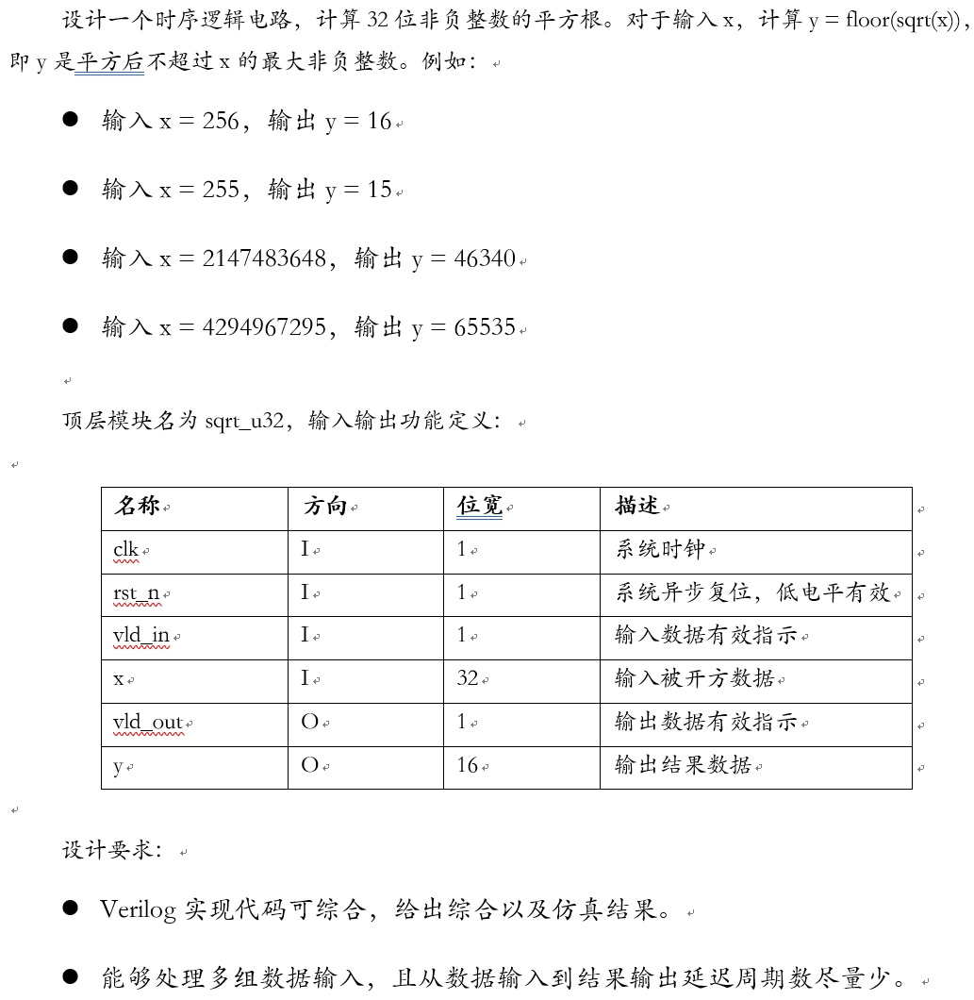
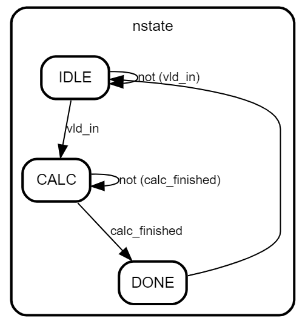
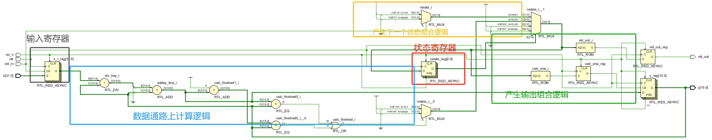
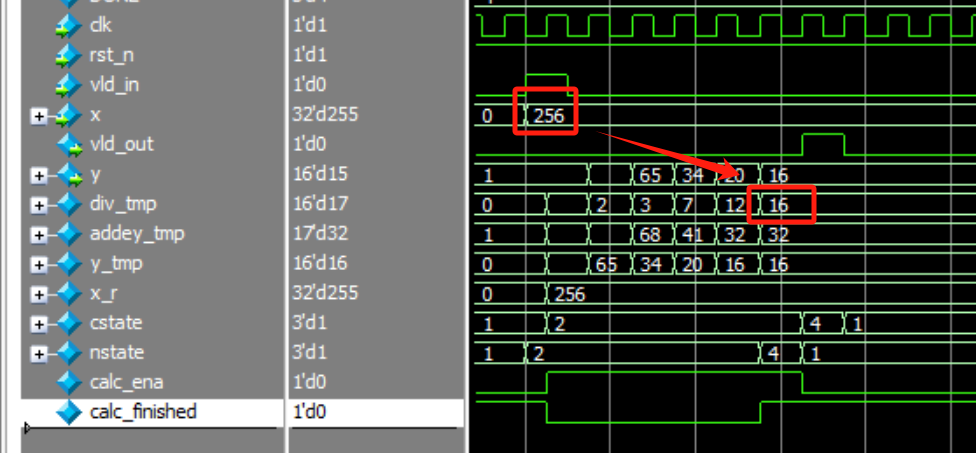
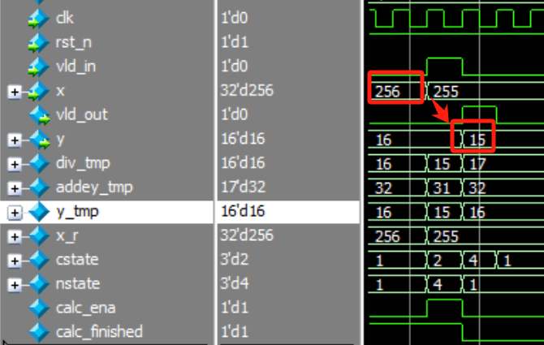
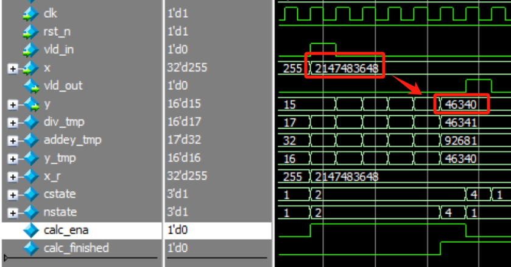

# 基于牛顿迭代法的平方根计算逻辑
## 1.设计功能与要求


## 2.算法原理
本设计采用 **牛顿迭代法** 算法，是一种通过迭代近似求解方程的方法。
### 牛顿迭代公式
设$r$为方程$f(x)=0$的根，设${{x}_{0}}$为$r$的初始近似值。过点$({{x}_{0}},f({{x}_{0}}))$做函数$y=f(x)$的切线L1: 

$y=f({{x}_{0}})+{f}'({{x}_{0}})(x-{{x}_{0}})$

L1与$x$轴交点横坐标为${{x}_{1}}={{x}_{0}}-\frac{f({{x}_{0}})}{{f}'({{x}_{0}})}$，称$x_1$为$r$的一次近似值。过点$({{x}_{1}},f({{x}_{1}}))$做函数$y=f(x)$的切线L2: 

$y=f({{x}_{1}})+{f}'({{x}_{1}})(x-{{x}_{1}})$

L2与cc$x$轴交点横坐标为${{x}_{2}}={{x}_{1}}-\frac{f({{x}_{1}})}{{f}'({{x}_{1}})}$，称${{x}_{2}}$为$r$的二次近似值。

反复迭代以上过程能够得到$r$的近似值序列，其规律为：${{x}_{n+1}}={{x}_{n}}-\frac{f({{x}_{n}})}{{f}'({{x}_{n}})}$，${{x}_{n+1}}$为$r$的n+1次近似值。

对于开平方根运算而言，设$f(x)={{x}^{2}}-a$，其中$a$为待开平方的输入数据，由牛顿迭代公式得${{x}_{n+1}}={{x}_{n}}-\frac{{{x}_{n}}^{2}-a}{2{{x}_{n}}}=\frac{1}{2}\left( {{x}_{n}}+\frac{a}{{{x}_{n}}} \right)$，本设计就是反复迭代直到${{x}_{n+1}}$收敛。*收敛的标志为第n+1次迭代所得的数值与第n次迭代相同，即${{x}_{n+1}={{x}_{n}}}$*

更加详细的举例和说明请参考**参考与致谢**第一篇博客。

综上所述，我们明确了基于牛顿迭代法的平方根计算逻辑的原理与步骤，下面将进行RTL实现。

## 3.RTL实现
根据第2小节中的描述和题目要求，本设计采用三段式状态机实现，其状态转移图如下所示，状态机共有三个状态，IDLE空闲状态检测输入有效信号vld_in，若为高电平则进入计算状态CALC，在CALC状态进行迭代计算直到上一个周期和当前周期计算数值相同或相差1拉高结束标志calc_finished进入DONE状态，然后DONE状态下一个时钟周期返回空闲状态IDLE。



### 3.1 控制通路
标志信号calc_ena控制计算的开始与否，当进入计算状态CALC时拉高。calc_finished控制状态转移到DONE状态标志计算结束，当上一周期的结果y_tmp与本周期计算结果y相等或相差1时拉高。calc_ena由三段式状态机控制。
```verilog
    // parameter define
    localparam IDLE = 3'b001;
    localparam CALC = 3'b010;
    localparam DONE = 3'b100;

    // signal define
    reg [2:0] cstate, nstate;
    reg calc_ena;
    wire calc_finished;//end calculate

    // FSM1
    always @(posedge clk or negedge rst_n) begin
        if(!rst_n)begin
            cstate <= IDLE;
        end
        else begin
            cstate <= nstate;
        end
    end

    // FSM2
    always @(*) begin
        case(cstate)
            IDLE: begin
                if(vld_in) nstate = CALC;
                else nstate = IDLE;
            end
            CALC: begin
                if(calc_finished) nstate = DONE;
                else nstate = CALC;
            end
            DONE: begin
                nstate = IDLE;
            end
            default: nstate = IDLE;
        endcase
    end

    // FSM3
    always @(posedge clk or negedge rst_n) begin
        if(!rst_n)begin
            vld_out <= 1'b0;
            calc_ena <= 1'b0;
        end
        else begin
            case (nstate)
                IDLE: begin
                    vld_out <= 1'b0;
                    calc_ena <= 1'b0;
                end
                CALC: begin
                    vld_out <= 1'b0;
                    calc_ena <= 1'b1;
                end
                DONE: begin
                    vld_out <= 1'b1;
                    calc_ena <= 1'b0;
                end
                default: begin
                    vld_out <= 1'b0;
                    calc_ena <= 1'b0;
                end
            endcase
        end
    end

    assign calc_finished = (y_tmp==y) || ((y_tmp+1'b1)==y);
```

### 3.2 数据通路
使用32位寄存器x_r在输入有效信号vld_in为高电平的时候寄存输入信号x并进入CALC状态进行计算，防止后续计算过程中输入x发生变化导致结果错误。
```verilog
    reg [31:0] x_r;

    // get input data x
    always @(posedge clk or negedge rst_n) begin
        if(!rst_n)begin
            x_r <= 32'd0;
        end
        else if(vld_in)begin
            x_r <= x;
        end
        else begin
            x_r <= x_r;
        end
    end
```

使用div_tmp计算$\frac{a}{{{x}_{n}}}$，其中$a$为待开方的输入数据。使用addey_tmp计算${{x}_{n}}+\frac{a}{{{x}_{n}}}$，使用y_tmp通过右移1位替代×$\frac{1}{2}$的计算。
```verilog
    wire [15:0] div_tmp;//temp divide data
    wire [16:0] addey_tmp;//output from adder
    wire [15:0] y_tmp;//temp y
    
    assign div_tmp = x_r/y;
    assign addey_tmp = {1'b0, div_tmp} + {1'b0, y};
    assign y_tmp = addey_tmp[16:1];

    always@(posedge clk,negedge rst_n) begin
        if(!rst_n) begin
            y <= 8'd1;
        end
        else if(calc_ena) begin
            y <= y_tmp;
        end
    end
```

### 3.3 完整代码
完整代码如下
```verilog
module SqrtCal(
    input clk,
    input rst_n,
    input vld_in,
    input [31:0] x,
    output reg vld_out,
    output reg [15:0] y
    );
    // parameter define
    localparam IDLE = 3'b001;
    localparam CALC = 3'b010;
    localparam DONE = 3'b100;

    // signal define
    reg [31:0] x_r;
    reg [2:0] cstate, nstate;
    reg calc_ena;
    wire calc_finished;//end calculate
    wire [15:0] div_tmp;//temp divide data
    wire [16:0] addey_tmp;//output from adder
    wire [15:0] y_tmp;//temp y

    // FSM1
    always @(posedge clk or negedge rst_n) begin
        if(!rst_n)begin
            cstate <= IDLE;
        end
        else begin
            cstate <= nstate;
        end
    end

    // FSM2
    always @(*) begin
        case(cstate)
            IDLE: begin
                if(vld_in) nstate = CALC;
                else nstate = IDLE;
            end
            CALC: begin
                if(calc_finished) nstate = DONE;
                else nstate = CALC;
            end
            DONE: begin
                nstate = IDLE;
            end
            default: nstate = IDLE;
        endcase
    end

    // FSM3
    always @(posedge clk or negedge rst_n) begin
        if(!rst_n)begin
            vld_out <= 1'b0;
            calc_ena <= 1'b0;
        end
        else begin
            case (nstate)
                IDLE: begin
                    vld_out <= 1'b0;
                    calc_ena <= 1'b0;
                end
                CALC: begin
                    vld_out <= 1'b0;
                    calc_ena <= 1'b1;
                end
                DONE: begin
                    vld_out <= 1'b1;
                    calc_ena <= 1'b0;
                end
                default: begin
                    vld_out <= 1'b0;
                    calc_ena <= 1'b0;
                end
            endcase
        end
    end

    // get input data x
    always @(posedge clk or negedge rst_n) begin
        if(!rst_n)begin
            x_r <= 32'd0;
        end
        else if(vld_in)begin
            x_r <= x;
        end
        else begin
            x_r <= x_r;
        end
    end

    assign calc_finished = (y_tmp==y) || ((y_tmp+1'b1)==y);
    assign div_tmp = x_r/y;
    assign addey_tmp = {1'b0, div_tmp} + {1'b0, y};
    assign y_tmp = addey_tmp[16:1];

    always@(posedge clk,negedge rst_n) begin
        if(!rst_n) begin
            y <= 8'd1;
        end
        else if(calc_ena) begin
            y <= y_tmp;
        end
    end

endmodule
```

Vivado RTL analysis结果如下图所示，符合设计预期。


## 4.RTL仿真结果
### 测试用例1：输入x = 32'd256，输出y = 16
仿真波形如下：


### 测试用例2：输入x = 32'd255，输出y = 15
仿真波形如下：


### 测试用例3：输入x = 32'd2147483648，输出y = 46340
仿真波形如下：


从波形可以看出本设计功能正确。

# 参考与致谢
#### 1. [轻松理解牛顿迭代法且用其求平方根](https://blog.csdn.net/u011863024/article/details/113095704 "轻松理解牛顿迭代法且用其求平方根")。
#### 2. [三种常见平方根算法的电路设计及Verilog实现与仿真](https://blog.csdn.net/weixin_44699856/article/details/130438117 "三种常见平方根算法的电路设计及Verilog实现与仿真")。


# 写在最后
2025年1月上旬总算结束了研一上学期繁忙的课程，总算有时间整理总结UCAS《高等数字集成电路分析与设计》课程中老师所布置的作业题，作为老师上课来不及仔细讲解内容的补充，也作为以后自己复习的参考。笔者作为初学者难免出现错误，请读者多多批评指正，也希望看到本博客的学弟学妹多多思考、不要盲目抄袭。

# 源码
verilog源码开源在：[lionelZhaowy/Digital-IC-Analysis-and-Design](https://github.com/lionelZhaowy/Digital-IC-Analysis-and-Design.git "lionelZhaowy/Digital-IC-Analysis-and-Design")

**作者：LionelZhao 欢迎转载，主动输出、与人分享是进步的源泉！！！**

**转载请保留原文地址：[lionelZhaowy/Digital-IC-Analysis-and-Design](https://github.com/lionelZhaowy/Digital-IC-Analysis-and-Design.git "lionelZhaowy/Digital-IC-Analysis-and-Design")**

**创作不易，如果觉得本文对您有帮助欢迎读者客官多多打赏！！！**


工程文件请在海鲜市场购买。
